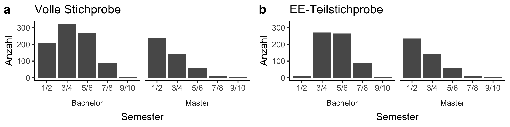

```{r setup, include=FALSE}
knitr::opts_chunk$set(echo = FALSE)
```

```{r imports, include=FALSE}
# functions, packages and static values
source("code/helpers/packages.R")
source("code/helpers/helper_functions.R")
source("code/helpers/static.R")
library(readxl)

# data
wide <- read_csv("data/wide.csv") %>% only_psych()
long <- read_csv("data/long.csv", col_types = cols(study_stage_open = col_character())) %>% 
  only_psych()

# results
b2 <- readRDS("data/block2_results.rds") # descriptives for question block 2
b3 <- readRDS("data/block3_results.rds") # descriptives for question block 3
ex <- readRDS("data/exploration.rds") # explorative analyses

# excel sheets
rp_overview <- read_excel("misc/practices_texts.xlsx")
```


```{r global variables, include=FALSE}
fnt <- "Times"
lbreak <- ""
tab.counter <- 0
rounding_number <- 1 # for percentages
online.suppl <- "placeholder"
link <- glue("[{online.suppl}]({online.suppl})")
tables <- list()
```

```{r observation numbers, include=FALSE}
n.all <- wide %>% nrow()
n.emp <- wide %>% filter(emp_experience == "Yes") %>% nrow()

n.allproj <- long %>% distinct(id, project, project_conducted) %>%
  pull(project_conducted) %>% sum()

n.all_clear_uni <- long %>% 
  filter(project_conducted) %>% 
  filter(uni_project != "_unclear") %>%
  distinct(id) %>% nrow()

n.unclearproj <- long %>% 
  filter(project_conducted) %>% 
  filter(uni_project == "_unclear") %>% 
  distinct(id, project) %>% nrow()

n.illog <- long %>% 
  filter(project_conducted) %>% 
  filter(is.na(rp_applied)) %>% 
  group_by(type_of_practice) %>% summarise(n = sum(illog_answ_subj)) %>% 
  pull(n)
names(n.illog) <- c("Open", "Questionable")

n.obs.qrp <- long %>% filter(project_conducted) %>% 
  filter(type_of_practice == "Questionable") %>% nrow()

n.obs.orp <- long %>% filter(project_conducted) %>% 
  filter(type_of_practice == "Open") %>% nrow()

n_qrp.expra.bsc <- long %>% filter(project_conducted) %>% 
  filter(project %in% c("thesis.bsc", "emp.intern")) %>% 
  filter(type_of_practice == "Questionable")

n_orp.expra.bsc <- long %>% filter(project_conducted) %>% 
  filter(project %in% c("thesis.bsc", "emp.intern")) %>% 
  filter(type_of_practice == "Open")

nproj.qrp.lin <- long %>% filter(project_conducted) %>% 
  filter(type_of_practice == "Questionable") %>% 
  filter(project %in% c("emp.intern", "thesis.bsc", "thesis.msc")) %>% 
  distinct(id, project) %>% nrow()

nproj.orp.lin <- long %>% filter(project_conducted) %>% 
  filter(type_of_practice == "Open") %>% 
  filter(project %in% c("emp.intern", "thesis.bsc", "thesis.msc")) %>% 
  distinct(id, project) %>% nrow()
```

```{r extracting values, include=FALSE}
# question 1: 
n_qrps <- b2$q01 %>% filter(type_of_practice == "Questionable") %>% pull(m) %>% co()
sd_qrps <- b2$q01 %>% filter(type_of_practice == "Questionable") %>% pull(sd) %>% co()

# question 2:
q02 <- b2$q02

n.q.emp <- q02 %>% 
  filter(project == "emp.intern", type_of_practice == "Questionable") %>% 
  pull(mean) %>% co()

n.q.ma <- q02 %>% 
  filter(project == "thesis.msc", type_of_practice == "Questionable") %>% 
  pull(mean) %>% co()

n.q.ba <- q02 %>% 
  filter(project == "thesis.bsc", type_of_practice == "Questionable") %>% 
  pull(mean) %>% co()

n.q.proj <- q02 %>% 
  filter(project == "project", type_of_practice == "Questionable") %>% 
  pull(mean) %>% co()

n.q.o <- q02 %>% 
  filter(project == "other", type_of_practice == "Questionable") %>% 
  pull(mean) %>% co()

# question 3
q03 <- b2$q03
q05 <- b2$q05

sh.samp <- q05 %>% filter(practice == "No Sample Planning") %>% 
  pull(share) %>% co(nround = rounding_number)

sh.srv <- q05 %>% filter(practice == "SR of Variables") %>% 
  pull(share) %>% co(nround = rounding_number)

sh.roundp <- q05 %>% filter(practice == "Rounding p-Values") %>% 
  pull(share) %>% co(nround = rounding_number)

sh.flexsamp <- q05 %>% filter(practice == "Flexible Sample Size") %>% 
  pull(share) %>% co(nround = rounding_number)

sh.pow <- q05 %>% filter(practice == "Power Analysis") %>% 
  pull(share) %>% co(nround = rounding_number)

sh.reg <- q05 %>% filter(practice == "Preregistration") %>% 
  pull(share) %>% co(nround = rounding_number)
```

<!-- Table definitions -->

```{r tab.cor}
tab.counter <- tab.counter + 1
tab.cor <- tab.counter

c <- wide %>% #distinct(id, .keep_all = TRUE) %>% 
  select(age, semester, importance, felt_information, interest, n_projects) %>% 
  as.matrix() %>% rcorr()

tcor <- format_cor(c, names = n.cor, bonferroni = T)

a0 <- tcor$alpha
a <-  a0 %>% quick.p()
b <- ifelse(a0[1] == 0.05, "", " (adjustierte Alpha-Niveaus nach Bonferroni)")
p_exp <- glue("Markierungen: * p < {a[1]}, ** p < {a[2]}, *** p < {a[3]}{b}")

tab.cor.print <- tcor$table %>% 
  mutate_at(2:7, str_replace, pattern = "\\.", replacement = ",") %>% 
  flextable() %>% 
  align(j = 2:7, align = "center", part = "header") %>% 
  align(j = 2:7, align = "left", part = "body") %>% 
  autofit() %>% 
  add_footer_lines(p_exp) %>% 
  footnote(i = 6, j = 1, value = as_paragraph("Anzahl der von der/dem jeweiligen Teilnehmenden begonnenen oder durchgeführten Projekte."), ref_symbols = "a", part = "body") %>% 
  flextable::font(fontname = fnt, part = "all") %>% 
  set_caption(glue("Tabelle {tab.counter}. Korrelationen zwischen numerischen Variablen."))

tables[[tab.counter]] <- tab.cor.print
```

```{r tab.rp_overview}
tab.counter <- tab.counter + 1 # counter increases automatically
tab.rp_overview <- tab.counter # individual counter for table

cap <- "Abgefragte Forschungspraktiken und Begleittexte."

tab.rp_overview.print <- rp_overview %>% 
  mutate(kurz = ifelse(!is.na(kurz), paste0("(", kurz, ")"), NA)) %>% 
  unite(col = "Bezeichnung (kurz)", lang, kurz, sep = " ") %>% 
  mutate_at(1, str_remove, pattern = " NA") %>% 
  flextable() %>% 
  width(1, width = 2.5) %>% 
  width(2, width = 4.5) %>% 
  flextable::font(fontname = "Times", part = "all") %>% 
  fontsize(j = 2, size = 10, part = "body") %>% 
  align(align = "left", part = "all") %>% 
  merge_at(i = 1, j = 1:2) %>% 
  merge_at(i = 11, j = 1:2) %>% 
  bold(i = c(1, 11), part = "body") %>% 
  set_caption(glue("Tabelle {tab.counter}. {cap}"))

tables[[tab.counter]] <- tab.rp_overview.print
```

```{r tab.rcL, echo=FALSE}
tab.counter <- tab.counter + 1 # counter increases automatically
tab.rcL <- tab.counter # individual counter for table

cap <- glue::glue("Anteil von Teilnehmenden, die in der jeweiligen Lehrveranstaltung an ihrer aktuellen (Alumni: letzten) Universität eine Thematisierung der Replikationskrise erfahren haben (N = {nrow(wide)}).")

tab.rcL.print <- b3$rc_teaching_specific_share %>% 
  mutate(lecture = recode(lecture,
                         "Methods, Stats, Expra" = "Methodenlehre, Statistik, Expra",
                         "Social Psychology" = "Sozialpsychologie",
                         "General Psychology" = "Allgemeine Psychologie",
                         "Introductory Class" = "Einführungsveranstaltung",
                         "Diagnostics" = "Diagnostik",
                         "Differential Psychology" = "Differentielle Psychologie",
                         "Other" = "Andere",
                         "Clinical Psychology" = "Klinische Psychologie",
                         "Biological- / Neuropsychology" = "Biologische / Neuropsychologie",
                         "Work, Organizational and Economic Psychology" = "Arbeits-, Betriebs- und Organisationspsychologie",
                         "Pedagogical Psychology" = "Pädagogische Psychologie",
                         "Developmental Psychology" = "Entwicklungspsychologie",
                         "Health Psychology" = "Gesundheitspsychologie",
                         "Media- / Communication Psychology" = "Medien- / Kommunikationspsychologie",
                         "Forensic" = "Forensische Psychologie")) %>% 
  mutate(share = share %>% co(nround = 1, nsmall = 1)) %>% 
  rename(`Lehrveranstaltung` = lecture,
         # n = count,
         `Anteil (%)` = share) %>%
  flextable() %>% 
  autofit() %>% 
  flextable::font(fontname = fnt, part = "all") %>% 
  set_caption(glue::glue("Tablle {tab.counter}. {cap}"))

tables[[tab.counter]] <- tab.rcL.print
```

```{r tab.qrpsL, echo=FALSE}
tab.counter <- tab.counter + 1 # counter increases automatically
tab.qrpsL <- tab.counter # individual counter for table

cap <- glue::glue("Anteil von Teilnehmenden, die an ihrer aktuellen (bei Alumni: letzten) Universität in mindestens einer Lehrveranstaltung eine kritische Betrachtung der jeweiligen Forschungspraktik erfahren haben (N = {nrow(wide)}).")

tab.qrpsL.print <- b3$qrps_teaching_share %>% 
  mutate(qrp = recode(qrp,
                         "HARKing" = "HARKing",
                         "No Sample Planning" = "Keine Stichprobenplanung",
                         "SR of Variables" = "S.B. von Variablen",
                         "SR of Hypotheses" = "S.B. von Hypothesen",
                         "Flexible Sample Size" = "Flexible Stichprobengröße",
                         "Flexible Exclusion" = "Flexibler Ausschluss von Beob.",
                         "SR of Conditions" = "S.B. von Bedingungen",
                         "Flexible Analysis" = "Flexible Datenanalyse",
                         "Rounding p-Values" = "Runden von p-Werten",
                         "Not Sure" = "Nicht sicher",
                         "None" = "Keine"
                         )) %>% 
  mutate(share = share %>% co(nround = 1, nsmall = 1)) %>% 
  rename(`Fragwürdige Forschungspraktik` = qrp,
         `Anteil (%)` = share) %>% 
  flextable() %>% 
  autofit() %>% 
  flextable::font(fontname = fnt, part = "all") %>% 
  set_caption(glue::glue("Tablle {tab.counter}. {cap}"))

tables[[tab.counter]] <- tab.qrpsL.print
```

```{r tab.glmm.qrp, echo=FALSE}
# custom part
tab.counter <- tab.counter + 1 # counter increases automatically
tab.glmm.qrp <- tab.counter # individual counter for table
m <- ex$qrp$models$m3
pred.names <- na1

# reference levels of categorical data in table
kat <- paste(ref.sex, ref.stage, ref.osi_at_uni, ref.osi, ref.rc, ref.practice_taught, ref.proj, sep = ", ")

# abbreviations used in table
abk.tab <-  paste(abk.rk, abk.osi, abk.qrp, abk.sb, abk.sf, sep = ", ")

# table caption
cap <- "Modell zur Untersuchung der Zusammenhänge von Kovariaten mit dem Einsatz fragwürdiger Forschungspraktiken. Schätzungen der fixen Effekte. Abhängige Variable: Forschungspraktik angewendet (0 – Nein, 1 – Ja)."

# automatic part
d <- m %>% model.frame() %>% as_tibble() # 'raw' data for this table
t <- m %>% glmer_table(names = pred.names) # table data

a0 <- t$alpha # used alpha level
a <-  a0 %>% quick.p()
b <- ifelse(a0[1] == 0.05, "", " (adjustierte Alpha-Niveaus nach Bonferroni)")
p_exp <- glue("Markierungen: * p < {a[1]}, ** p < {a[2]}, *** p < {a[3]}{b}")

n.obsx <- d %>% nrow(); n.obs <- n.obsx %>% format(big.mark = ' ')
n.projx <- d %>% distinct(id, project) %>% nrow()
n.proj <- n.projx %>% format(big.mark = ' ')
n.subjx <- d %>% distinct(id) %>% nrow()
n.subj <- n.subjx  %>% format(big.mark = ' ')
n <- glue("Datenpunkte insg. = {n.obs}, Projekte = {n.proj}, Teilnehmende = {n.subj}")

ref <- paste0("Referenzkategorien: ", kat, ".\n")
abk <- abk.f(abk.glmer, abk.tab)

# table
tab.glmm.qrp.print <- t$table %>% 
  select(-1) %>% 
  mutate_at(c(2, 3, 4, 6), co) %>% 
  flextable() %>% 
  align(j = c(1, 7), align = "left", part = "body") %>% 
  align(j = c(1, 7), align= "left", part = "header") %>% 
  autofit() %>% 
  add_footer_lines(c(glue("Anmerkungen. {n}"), ref, abk, p_exp)) %>% 
  set_caption(glue("Tabelle {tab.counter}. {cap}")) %>% 
  flextable::font(fontname = fnt, part = "all") %>% 
  set_caption(glue("Tabelle {tab.counter}. {cap}")) %>% 
  identity()

tables[[tab.counter]] <- tab.glmm.qrp.print
```

```{r tab.inf, echo=FALSE}
# custom part
tab.counter <- tab.counter + 1 # counter increases automatically
tab.inf <- tab.counter # individual counter for table
m <- ex$inf$models$m2
pred.names <- na6
d <- ex$data$att
# m %>% summary()

# reference levels of categorical data in table
kat <- paste(ref.sex, ref.stage, ref.osi_at_uni, ref.osi, ref.rc, sep = ", ")

# abbreviations used in table
abk.tab <-  paste(abk.sf, abk.osi, abk.rk, sep = ", ")

# table caption
cap <- "Modell zur Untersuchung von Zusammenhängen der Kovariaten mit dem Eindruck der Teilnehmenden, wie gut sie über den Themenkomplex 'Replikationskrise und Open Science' informiert sind. Schätzungen der fixen Effekte. Abhängige Variable:  Eindruck von Informiertheit (numerisch, min: 1 (gar nicht), max: 5 (sehr), z-standardisiert)."

# automatic part
t <- m %>% lmer_table(names = pred.names) # table data

a0 <- t$alpha # used alpha level
a <-  a0 %>% quick.p()
b <- ifelse(a0[1] == 0.05, "", " (adjustierte Alpha-Niveaus nach Bonferroni)")
p_exp <- glue("Markierungen: * p < {a[1]}, ** p < {a[2]}, *** p < {a[3]}{b}")

n.subjx <- d %>% distinct(id) %>% nrow()
n.subj <- n.subjx  %>% format(big.mark = ' ')
n <- glue("Anmerkungen. N = {n.subj}")

ref <- paste0("Referenzkategorien: ", kat, ".\n")
abk <- abk.f(abk.glmer, abk.tab)

# table
tab.inf.print <- t$table %>% 
  select(-1) %>% 
  mutate_at(2:4, co) %>% 
  flextable() %>% 
  align(j = c(1, 5), align = "left", part = "body") %>% 
  align(j = c(1, 5), align= "left", part = "header") %>% 
  # autofit() %>% 
  add_footer_lines(c(n, ref, abk, p_exp)) %>% 
  set_caption(glue("Tabelle {tab.counter}. {cap}")) %>% 
  width(1, width = 2) %>%
  width(c(2,3,4,5), width = 1) %>%
  # width(5, width = 1) %>%
  flextable::font(fontname = fnt, part = "all") %>% 
  identity()

tables[[tab.counter]] <- tab.inf.print
```


# Zusammenfassung

# Einleitung

Testzitat [@Simmons2018a]

# Methode

# Ergebnisse

## Deskriptive Ergebnisse
### Verbreitung fragwürdiger Forschungspraktiken

Den Ergebnissen in diesem Abschnitt liegen die Daten der EF (Empirische Erfahrung)-Teilstichprobe (N = `r n.all`) zugrunde.

Aus den Angaben der Teilnehmenden ergibt sich ein mittlerer Einsatz von `r n_qrps` (SD = `r sd_qrps`) fragwürdigen Forschungspraktiken pro Projekt. Wie in Abbildung \@ref(fig:plot.nqrps) zu sehen ist, zeigen sich dabei Unterschiede zwischen den abgefragten Projekten. Besonders viele fragwürdige Praktiken scheinen demnach mit durchschnittlich `r n.q.emp` (SD = `r q02 %>% filter(project == "emp.intern", type_of_practice == "Questionable") %>% pull(sd) %>% co()`) Praktiken pro Projekt im Expra verwendet zu werden, während Masterarbeiten mit durchschnittlich `r n.q.ma` (SD = `r q02 %>% filter(project == "thesis.msc", type_of_practice == "Questionable") %>% pull(sd) %>% co()`) verwendeten fragwürdigen Praktiken den niedrigsten Wert aufweisen. Bachelor- und Projektarbeiten sowie andere Projekte (durchschnittlich jeweils `r n.q.ba` (SD = `r q02 %>% filter(project == "thesis.bsc", type_of_practice == "Questionable") %>% pull(sd) %>% co()`), `r n.q.proj` (SD = `r q02 %>% filter(project == "project", type_of_practice == "Questionable") %>% pull(sd) %>% co()`) und `r n.q.o` (SD = `r q02 %>% filter(project == "other", type_of_practice == "Questionable") %>% pull(sd) %>% co()`) fragwürdige Praktiken pro Projekt) liegen dazwischen. Betrachtet man die Projekte, die sich eindeutig nach Studienfortschritt ordnen lassen, also Expra, Bachelorarbeit und Masterarbeit, so zeigt sich ein deutlicher Trend: Mit fortschreitendem Studium wurden immer weniger fragwürdige Forschungspraktiken von den Teilnehmenden eingesetzt.

<p style="text-align: center;">(( Abbildung \@ref(fig:plot.nqrps) ungefähr hier platzieren. ))</p>

In Abbildung \@ref(fig:plot.rp_details) ist die Einsatzhäufigkeit der einzelnen abgefragten Forschungspraktiken dargestellt. Als am häufigsten eingesetzte fragwürdige Forschungsmethoden zeigten sich fehlende Stichprobenplanung und selektives Berichten abhängiger Variablen mit einem Anteil von `r sh.samp` %, bzw. `r sh.srv` % betroffenen Projekten. Die von den Teilnehmenden am seltensten eingesetzten Methoden waren das Abrunden von p-Werten und das Nacherheben von Versuchspersonen zum Zweck der Herbeiführung statistischer Signifikanz mit `r sh.roundp` %, bzw. `r sh.flexsamp` % betroffenen Projekten. Die beiden offenen, bzw. positiven Forschungspraktiken, die ebenfalls Teil der Befragung waren, rangieren am oberen Ende der Einsatzhäufigkeit: Laut Angaben der Teilnehmenden wurde für `r sh.pow` % der erfassten Projekte eine Power-Analyse zur Stichprobenplanung durchgeführt, und `r sh.reg` % der erfassten Projekte wurden präregistriert. Die Präregistrierung fand am häufigsten bei einer Lehrperson statt (`r b2$prereg_data %>% filter(names_prereg_where == "lecturer") %>% pull(prereg_counts)` mal gewählt). Es folgen in nach Häufigkeit absteigender Reihenfolge als Plattformen für Präregistrierungen das Open Science Framework (OSF, `r b2$prereg_data %>% filter(names_prereg_where == "osf.io") %>% pull(prereg_counts)` mal gewählt), aspredicted.org (`r b2$prereg_data %>% filter(names_prereg_where == "aspredicted.org") %>% pull(prereg_counts)` mal gewählt), "andere" (`r b2$prereg_data %>% filter(names_prereg_where == "other") %>% pull(prereg_counts)` mal gewählt) und ein Journal (`r b2$prereg_data %>% filter(names_prereg_where == "journal") %>% pull(prereg_counts)` mal gewählt). Von den Teilnehmenden gaben `r b2$prereg_data %>% filter(names_prereg_where == "never preregistered") %>% pull(prereg_counts)` Personen an, nie eines ihrer empirischen Projekte präregistriert zu haben.

Anzumerken ist, dass hier *nicht* wie bei @John2012 der Anteil der Teilnehmenden gezeigt wird, die die jeweilige Forschungspraktik *mindestens einmal* verwendet haben, sondern der Anteil der pro Forschungspraktik betroffenen Projekte. Diese Berechnung erlaubt eine detailliertere Betrachtung, da Informationen über alle `r n.allproj` im Datensatz enthaltenen Projekte dargestellt werden, anstelle sich auf einen (ungenaueren) Datenpunkt pro Teilnehmer\*in zu beschränken. Aus diesem Grund weichen wir hier von unserer Präregistrierung [(https://osf.io/k85r4/)](https://osf.io/k85r4/) ab, die eine Darstellung analog zu @John2012 vorsah ("Praktikaggregation"). Diese Darstellung kann in den [ergänzenden Online-Materialien](https://jobrachem.github.io/Students-Open-Science-Survey/supplementary_data-edited.pdf)(LINK) dennoch abgerufen werden und zeigt generell ein ähnliches Bild, wobei die Prävalenzschätzungen durch den Informationsverlust überhöht sind. Wir verzichten zugunsten einer prägnanteren Darstellung hier außerdem auf die in der Registrierung vorgesehene "Detailaggregation", eine Aufschlüsselung der Praktikaggregation nach Forschungsprojekt. Sie kann ebenfalls in den Online-Materialien abgerufen werden.

### Zusätzliche Ergebnisse

Den Ergebnissen in diesem Abschnitt liegen die Daten der vollen Stichprobe (N = `r n.all`) zugrunde.

```{r additional results, echo=FALSE}
heard_of_rc <- b3$rc_teaching_general %>% 
  group_by(rc_teaching) %>% 
  mutate(n_sum = sum(n_semester)) %>%
  mutate(n_answer = sum(n)) %>% 
  mutate(share = (n_answer / n_sum) * 100) %>% 
  distinct(share, rc_teaching)

# a little wasteful workaround to get the correct number of students per
# study stage.
tmp <- wide %>% 
           group_by(study_stage_mc) %>% 
           summarise(n = n()) %>% 
  arrange(study_stage_mc) %>% 
  pull(n)

heard_of_rc_stage <- b3$rc_teaching_general %>% 
  arrange(study_stage_mc) %>% 
  mutate(n_sum = recode(study_stage_mc, 
                        "Bachelor" = tmp[1], 
                        "I don't study (any more)" = tmp[2], 
                        "Master" = tmp[3], 
                        "Other" = tmp[4])) %>% 
  group_by(rc_teaching, study_stage_mc) %>% 
  mutate(n_answer = sum(n)) %>% 
  mutate(share = (n_answer / n_sum) * 100) %>% 
  distinct(share, rc_teaching)
```

#### Behandlung der Replikationskrise in der Lehre 

Zu den hier dargestellten Ergebnissen finden sich ausführliche Tabellen mit allen Daten in den [ergänzenden Online-Materialien](https://jobrachem.github.io/Students-Open-Science-Survey/supplementary_data-edited.pdf) (LINK).

**Thematisierung der Replikationskrise**. Insgesamt gaben `r heard_of_rc %>% filter(rc_teaching == "yes") %>% pull(share) %>% co(nround = 1, nsmall = 1)` % der Teilnehmenden an, dass die Replikationskrise an ihrer jeweils aktuellen Universität in Lehrveranstaltungen thematisiert wurde; `r heard_of_rc %>% filter(rc_teaching == "no") %>% pull(share) %>% co(nround = 1, nsmall = 1)` % gaben an, dass sie nicht thematisiert wurde. Die restlichen `r heard_of_rc %>% filter(rc_teaching == "unsure") %>% pull(share) %>% co(nround = 1, nsmall = 1)` % der Teilnehmenden antworteten mit "Weiß ich nicht". Erfreulich ist dabei, dass selbst unter den Studienanfänger\*innen (Studierende im ersten oder zweiten Bachelor-Semester) `r b3$rc_teaching_general %>% filter(study_stage_mc == "Bachelor" & semester == "1/2" & rc_teaching == "yes") %>% pull(share) %>% co(nround = 1, nsmall = 1)` % der Teilnehmenden angaben, in Lehrveranstaltungen von der Replikationskrise gehört zu haben. Für alle Studierenden im Bachelor und im Master zeigte sich im Allgemeinen ein ähnliches Bild mit `r heard_of_rc_stage %>% filter(study_stage_mc == "Bachelor" & rc_teaching == "yes") %>% pull(share) %>% co(nround = 1, nsmall = 1)` %, bzw. `r heard_of_rc_stage %>% filter(study_stage_mc == "Master" & rc_teaching == "yes") %>% pull(share) %>% co(nround = 1, nsmall = 1)` % positiven Antworten.

**Betrachtung nach Lehrveranstaltungen**. Die Behandlung der Replikationskrise fand größtenteils in der Methodenlehre (inkl. Expra) statt: `r b3$rc_teaching_specific_share %>% filter(lecture == "Methods, Stats, Expra") %>% pull(share) %>% co(nround = 1, nsmall = 1)` % der Teilnehmenden gaben an, dass hier die Replikationskrise thematisiert wurde. In der Lehre der Sozialpsychologie, der am stärksten im Fokus der Kritik stehenden Teildisziplin, wurde am zweithäufigsten über die Replikationskrise berichtet (`r b3$rc_teaching_specific_share %>% filter(lecture == "Social Psychology") %>% pull(share) %>% co(nround = 1, nsmall = 1)` %). In den 13 übrigen Fachbereichen (inkl. "Andere") bewegt sich die Abdeckung zwischen `r b3$rc_teaching_specific_share %>% filter(lecture == "General Psychology") %>% pull(share) %>% co(nround = 1, nsmall = 1)` % (Allgemeine Psychologie) und `r b3$rc_teaching_specific_share %>% filter(lecture == "Forensic") %>% pull(share) %>% co(nround = 1, nsmall = 1)` % (Forensische Psychologie). Dabei sollte beachtet werden, dass wohl nur ein Bruchteil der Befragten Module in Forensischer Psychologie belegt haben dürfte.

**Behandlung fragwürdiger Praktiken**. Studierende erleben im Studium durchaus eine kritische thematisierung einzelner fragwürdiger Forschungspraktiken. So gaben `r b3$qrps_teaching_share %>% filter(qrp == "HARKing") %>% pull(share) %>% co(nround = 1, nsmall = 1)` % der Teilnehmenden an, eine Problematisierung von HARKing (Hypothesizing After the Results are Known, das Aufstellen von Hypothesen nach Kenntnis der Ergebnisse) erfahren zu haben. HARKing stellte sich als die am häufigsten in der Lehre kritisierte fragwürdige Forschungspraktik heraus. Auf den folgenden Plätzen finden sich fehlende Stichprobenplanung (`r b3$qrps_teaching_share %>% filter(qrp == "No Sample Planning") %>% pull(share) %>% co(nround = 1, nsmall = 1)` %) und selektives Berichten von Variablen (`r b3$qrps_teaching_share %>% filter(qrp == "SR of Variables") %>% pull(share) %>% co(nround = 1, nsmall = 1)` %). Am seltensten wurden Flexibilität in der Datenanalyse (`r b3$qrps_teaching_share %>% filter(qrp == "Flexible Analysis") %>% pull(share) %>% co(nround = 1, nsmall = 1)` %) und das Abrunden von p-Werten (`r b3$qrps_teaching_share %>% filter(qrp == "Rounding p-Values") %>% pull(share) %>% co(nround = 1, nsmall = 1)` %) kritisch thematisiert.

#### Einstellung von Studierenden

Abbildung \@ref(fig:plot.attitudes) zeigt die Einschätzung der Wichtigkeit des Themenkomplexes “Open Science und Replikationskrise” durch die Teilnehmenden, ihr Interesse daran und ihre Einschätzung dazu, wie gut sie über das Thema informiert sind. Deutlich wird, dass das Thema von der überwältigenden Mehrheit der Teilnehmenden für wichtig gehalten wird, dass eine Mehrheit der Teilnehmenden Interesse an dem Thema hat, und dass sich ein substanzieller Teil der Teilnehmenden als nicht gut informiert einschätzt.

#### Korrelationen

Die einfachen Korrelationen zwischen den numerischen Variablen finden sich in Tabelle `r tab.cor`.

## Explorative Analysen

Zur näheren Untersuchung der Daten führten wir eine Reihe von explorativen Analysen durch, von denen wir die wichtigsten hier berichten. Alle weiteren oder nur kurz erwähnten Analysen sind in den Online-Materialien (LINK) abrufbar. Die Analysen wurden in R (Zitat) mit dem Paket "lme4" (Zitat) ausgeführt. Für alle Analysen wurden Bonferroni-korrigierte Alpha-Niveaus zugrunde gelegt.

### Einsatz fragwürdiger Forschungsmethoden

```{r GLMM QRPs LR Tests, include=FALSE}
an1 <- ex$qrp$lr_tests$an1
an2 <- ex$qrp$lr_tests$an2

m0 <- ex$qrp$models$m0
m1a <- ex$qrp$models$m1a %>% VarCorr()
m1b <- ex$qrp$models$m1b %>% VarCorr()
m1c <- ex$qrp$models$m1c %>% VarCorr()

chi1.1 <- an1$Chisq[[2]] %>% co()
chi1.2 <- an2$Chisq[[2]] %>% co()
chi1.3 <- an2$Chisq[[3]] %>% co()

df1.1 <- an1$`Chi Df`[[2]]
df1.2 <- an2$`Chi Df`[[2]]
df1.3 <- an2$`Chi Df`[[3]]

p1.1 <- an1$`Pr(>Chisq)`[[2]] %>% printp()
p1.2 <- an2$`Pr(>Chisq)`[[2]] %>% printp()
p1.3 <- an2$`Pr(>Chisq)`[[3]] %>% printp()

sd1.1 <- m1c$id %>% as.numeric() %>% sqrt() %>% co()
sd1.2 <- m1c$uni_project %>% as.numeric() %>% sqrt() %>% co()
sd1.3 <- m1c$practice %>% as.numeric() %>% sqrt() %>% co()

betas <- summary(ex$qrp$models$m3)$coefficients %>% exp() %>% co()
```

In einem generalisierten linearen gemischten Modell für dichotome abhängige Variablen mit logit-Linkfunktion nahmen wir alle verfügbaren, potentiell informativen Kovariaten auf, um die Odds für den Einsatz fragwürdiger Forschungspraktiken zu modellieren. Abhängige Variable war ein Indikator dafür, ob eine spezifische Forschungspraktik in einem spezifischen Projekt eingesetzt wurde (0 = "Nein", 1 = "Ja"). Das Modell enthält zufällige Achsenabschnitte für den/die jeweilige/n Teilnehmer\*in (SD = `r sd1.1`, $\chi^2$ (`r df1.1`) = `r chi1.1`, `r p1.1`), für die Universität, an der das Projekt durchgeführt wurde (SD = `r sd1.2`, $\chi^2$ (`r df1.2`) = `r chi1.2`, `r p1.2`), und für die spezifische Forschungspraktik (SD = `r sd1.3`, $\chi^2$ (`r df1.3`) = `r chi1.3`, `r p1.3`). Die numerischen Prädiktoren wurden z-standardisiert. Die Schätzungen der fixen Koeffizienten und die jeweiligen Odds Ratios sind in Tabelle `r tab.glmm.qrp` dargestellt. Zugrunde lagen die Daten aus der EE-Teilstichprobe. 

Einzelne Beobachtungen wurden wegen inkonsistenter Antworten oder unklarer Zuordnung des jeweiligen Projektes zu einer Universität ausgeschlossen. Ersteres geschah in Fällen, in denen Teilnehmende bei der Frage nach der Anwendung einer spezifischen Forschungspraktik sowohl die Antwortmöglichkeit "Keines" (Praktik wurde in keinem Projekt verwendet), als auch mindestens ein oder mehrere Projekte auswählten (bei QRPs n = `r n.illog[2]` Beobachtungen). Zweiteres geschah bei den Projekten "Projektarbeit" und "Anderes", wenn die Teilnehmenden ihre Universität zwischen Bachelor und Master gewechselt hatten, oder bei Alumni/Alumnae, da deren Bachelor-Universität nicht erfasst wurde (n = `r n.unclearproj` Projekte). Zwischen beiden Kriterien gab es Überschneidungen. Insgesamt wurden so `r n.obs.qrp - n.obsx` Datenpunkte zu `r n.allproj - n.projx` Projekten von `r n.emp - n.subjx` Teilnehmenden in der Analyse nicht berücksichtigt.

Das Effektstärkemaß Odds Ratio gibt die multiplikative Änderung im Verhältnis der *Odds* (dt.: Chancen) von "Forschungspraktik angewandt" und "Forschungspraktik nicht angewandt" bei Änderung des Prädiktors um eine Einheit, bzw. bei kategorialen Prädiktoren im Vergleich zur Referenzgruppe an. Ein Odds Ratio größer als 1 bedeutet, dass die Anwendung der Forschungspraktik wahrscheinlicher wird, ein Odds Ratio unter 1, dass sie weniger wahrscheinlich wird. Zunächst lässt sich beobachten, dass QRPs umso weniger eingesetzt wurden, je eher Teilnehmende den Themenkomplex "Replikationskrise und Open Science" als wichtig ansahen und je eher sie sich als gut informiert einschätzten (Odds Ratios von `r betas["importance", 1]` und `r betas["felt_information", 1]`).

Darüber hinaus lassen sich Unterschiede zwischen den einzelnen Projekttypen erkennen, wobei alle Projekttypen im Vergleich zur Referenzkategorie "Expra" eine geringere Wahrscheinlichkeit des Einsatzes von QRPs aufweisen. Die Effektstärken variieren dabei von OR = `r betas["projectthesis.msc", 1]` (Masterarbeiten) bis OR = `r betas["projectproject", 1]` (Projektarbeit). Bei einer Masterarbeit ist die Chance, dass eine fragwürdige Forschungspraktik eingesetzt wird, also weniger als ein Drittel der Chance, dass sie in einem Expra eingesetzt wird. Die übrigen untersuchten Kovariaten wiesen keinen signifikanten Zusammenhang mit dem Einsatz von QRPs auf (siehe Tabelle `r tab.glmm.qrp`).

```{r GLMM QRPs linear, include=FALSE}
m <- ex$lin.qrp$models$m3
t <- m %>% glmer_table(names = na4a)
b <- t$table %>% filter(predictor == "project.L")
```

In einem nächsten Schritt untersuchten wir im Detail, ob sich Hinweise für eine systematische Veränderung der Einsatzwahrscheinlichkeit von QRPs im Verlauf des Studiums finden. Dazu betrachteten wir ausschließlich Expras, Bachelorarbeiten und Masterarbeiten, da diese Projekte eindeutig verschiedenen Phasen des Studiums zugeordnet werden können. Die Analyse wurde auch hier mit einem generalisierten linearen gemischten Modell für dichotome abhängige Variablen mit logit-Linkfunktion mit der gleichen abhängigen Variable und, abgesehen vom Projekttyp, den gleichen Kovariaten wie im vorherigen Modell durchgeführt. Der Projekttyp wurde nun als geordneter Faktor in das Modell mit aufgenommen, so dass ein linearer Trend über die drei eingeschlossenen Projekttypen untersucht werden konnte. Tatsächlich zeigte sich ein linearer Trend, OR = `r b[,5]` `r b[, 6]`, p `r str_replace(b[, 8], "\\*\\*\\*", "")`, der darauf hindeutet, dass mit fortschreitendem Studium, bzw. in anspruchsvolleren Projekten mit geringerer Wahrscheinlichkeit QRPs angewandt werden.

### Einsatz positiver Forschungspraktiken

```{r}
m <- ex$orp$models$m3 %>% glmer_table(names = na2)
m$table <- m$table %>% mutate_at(.vars = c(3, 4, 5, 7), co)
m.lin <- ex$lin.orp$models$m3 %>% glmer_table(names = na4b)
m.lin$table <- m.lin$table %>% mutate_at(.vars = c(3, 4, 5, 7), co)
```


Die Ergebnisse bezüglich positiver Forschungspraktiken fassen wir hier nur kurz zusammen. Die vollständigen Tabellen zu allen Modellen können in den Online-Materialien (LINK) abgerufen werden. Wir untersuchten hier ebenfalls in generalisierten gemischten linearen Modellen die gleichen Prädiktoren und zufälligen Achsenabschnitte wie bei der Exploration zu QRPs (Fußnote: Mit Ausnahme von "Praktik gelehrt", da diese Frage nur für QRPs gestellt wurde). Signifikante Unterschiede zeigten sich zwischen Master- und Bachelorstudierenden (B = `r m$table[[7, 3]]`, SE = `r m$table[[7, 4]]`, OR = `r m$table[[7, 5]]`, 95 % KI = `r m$table[[7, 6]]`,  p = `r str_replace(m$table[[7, 8]], "\\*  ", "")`). Master-Studierende wiesen demnach eine geringere Wahrscheinlichkeit für den Einsatz positiver Forschungspraktiken auf als Bachelor-Studierende. Diese Beobachtung zeigte sich noch deutlicher, wenn nur Expras und Bachelorarbeiten untersucht wurden, so dass ein etwas direkterer Vergleich zwischen länger zurückliegenden Projekten (Expras und Bachelorarbeiten von aktuellen Master-Studierenden) und kürzer zurückliegenden Projekten (von aktuellen Bachelor-Studierenden) gezogen werden kann (siehe Online-Materialien, LINK).

Auch in diesem Modell zeigte sich ein Einfluss der subjektiv eingeschätzten Informiertheit der Teilnehmenden, je informierter sie sich sahen, desto wahrscheinlicher war der Einsatz positiver Forschungspraktiken (B = `r m$table[[12, 3]]`, SE = `r m$table[[12, 4]]`, OR = `r m$table[[12, 5]]`, 95 % KI = `r m$table[[12, 6]]`,  p `r str_replace(m$table[[12, 8]], "\\*\\*\\*", "")`). In Projektarbeiten (B = `r m$table[[19, 3]]`, SE = `r m$table[[19, 4]]`, OR = `r m$table[[19, 5]]`, 95 % KI = `r m$table[[19, 6]]`,  p `r str_replace(m$table[[19, 8]], "\\*\\*\\*", "")`) und "Anderen" Projekten (B = `r m$table[[18, 3]]`, SE = `r m$table[[18, 4]]`, OR = `r m$table[[18, 5]]`, 95 % KI = `r m$table[[18, 6]]`,  p `r str_replace(m$table[[18, 8]], "\\*\\*\\*", "")`) wurden jeweils mit signifikant geringerer Wahrscheinlichkeit positive Praktiken eingesetzt als im Expra (Details siehe Online-Materialien, LINK).

Ein linearer Trend über den Studienverlauf wie bei QRPs zeigte sich in einer weiteren Analyse nicht, wohl aber ein quadratischer Trend (B = `r m.lin$table[[19, 3]]`, SE = `r m.lin$table[[19, 4]]`, OR = `r m.lin$table[[19, 5]]`, 95 % KI = `r m.lin$table[[19, 6]]`,  p `r str_replace(m.lin$table[[19, 8]], "\\*\\*\\*", "")`). Die Unterschiede zwischen Bachelorarbeiten und Expras (B = `r m$table[[20, 3]]`, SE = `r m$table[[20, 4]]`, OR = `r m$table[[20, 5]]`, 95 % KI = `r m$table[[20, 6]]`,  p = `r str_replace(m$table[[20, 8]], "\\*\\*\\*", "")`) sowie zwischen Masterarbeiten und Expras (B = `r m$table[[21, 3]]`, SE = `r m$table[[21, 4]]`, OR = `r m$table[[21, 5]]`, 95 % KI = `r m$table[[21, 6]]`,  p = `r str_replace(m$table[[21, 8]], "\\*\\*\\*", "")`) waren in der vorgehenden Analyse statistisch nicht signifikant, die Odds Ratios deuten aber tendenziell darauf hin, dass verglichen mit Expras in Bachelorarbeiten mit geringerer und in Masterarbeiten mit höherer Wahrscheinlichkeit positive Forschungspraktiken angewendet werden. Vor diesem Hintergrund erscheint der quadratische Trend für den Studienverlauf plausibel.

### Eindruck von Informiertheit

```{r LMER felt_information, include=FALSE}
an1 <- ex$inf$lr_tests$an1

m1 <- ex$inf$models$m1 %>% VarCorr()

chi1.1 <- an1$Chisq[[2]] %>% co()
df1.1 <- an1$`Chi Df`[[2]]
p1.1 <- an1$`Pr(>Chisq)`[[2]] %>% printp()
sd1.1 <- m1$uni_current %>% as.numeric() %>% sqrt() %>% co()

betas <- summary(ex$inf$models$m2)$coefficients %>% co()
```


Welche Faktoren hängen damit zusammen, ob Studierende sich über den Themenkomplex gut informiert fühlen?

In einer weiteren explorativen Analyse untersuchten wir den Zusammenhang zwischen den verfügbaren, potentiell informativen Kovariaten und der subjektiven Informiertheit unserer Teilnehmenden über den Themenkomplex "Replikationskrise und Open Science". Für die Analyse nutzten wir ein lineares gemischtes Modell mit einem zufälligen Achsenabschnitt für die aktuelle (bei Alumni/Alumnae: letzte) Universität (SD = `r sd1.1`, $\chi^2$ (`r df1.1`) = `r chi1.1`, `r p1.1`). Die Schätzungen der fixen Koeffizienten sind in Tabelle `r tab.inf` dargestellt.

Die Analyse deutet auf signifikante positive Zusammenhänge der subjektiven Informiertheit mit der Anzahl von durchgeführten oder begonnenen Projekten und der Wichtigkeit, die dem Themenkomplex "Replikationskrise und Open Science" beigemessen wird. Ob es de facto eine im Netzwerk der Open Science Initiativen gelistete Open Science Initiative an der jeweiligen Universität gibt, scheint nicht mit der subjektiven Informiertheit der Teilnehmenden zusammenzuhängen, wohl aber das Wissen der Teilnehmenden um eine Open Science Initiative an ihrer Universität: Sowohl Teilnehmende, die sich über diese Frage unsicher sind, als auch solche, die eine Intiative an ihrer Universität kennen (etwas größerer Zusammenhang als bei unsicheren Teilnehmenden), schätzen sich als besser informiert ein, als Teilnehmende, die keine Initiative an ihrer Universität kennen. Schließlich zeigt sich auch ein deutlicher Zusammenhang zwischen einer berichteten Behandlung der Replikationskrise in der Lehre und der subjektiven Informiertheit der Teilnehmenden: Mit einem Beta-Gewicht von `r betas["rc_teachingyes", 1]` ist dies sogar der stärkste in dieser Analyse beobachtete Zusammenhang. Demnach schätzten sich Studierende, die über eine Behandlung der Replikationskrise in der Lehre an ihrer Universität berichteten im Mittel um `r betas["rc_teachingyes", 1]` Standardabweichungen besser informiert ein ein als Studierende, denen dieses Thema nicht in der Lehre begegnet ist. 

Weitere explorative Analysen führten wir zur Behandlung der Replikationskrise in der Lehre und zur subjektiv eingeschätzten Wichtigkeit des Themenkomplexes "Replikationskrise und Open Science" durch unsere Teilnehmenden durch. Die Ergebnisse können in den zusätzlichen Online-Materialien (LINK) abgerufen werden.


# Diskussion


# Abbildungen

```{r nsems, echo=FALSE, fig.cap="Aufschlüsselung der Teilnehmenden nach Studienfortschritt. (a) Volle Stichprobe. (b) EE-Teilstichprobe."}

```

```{r nqrps, echo=FALSE, fig.cap="Anzahl eingesetzter fragwürdiger Forschungspraktiken aufgeschlüsselt nach Art des Projekts. BA = Bachelorarbeit, MA = Masterarbeit"}
knitr::include_graphics('../plots/german/n_qrps_per_project_ger.png')
```

```{r rpdetails, echo=FALSE, fig.cap="Anteil von Projekten, in denen die jeweilige Forschungspraktik eingesetzt wurde. S.B. = Selektives Berichten."}
knitr::include_graphics('../plots/german/rp_detailed_ger.png')
```

```{r attitudes, echo=FALSE, fig.cap="Einstellungen der Teilnehmenden zum Themenkomplex \"Open Science und Replikationskrise\" auf einer 5-Punkte Likert-Skala von \"gar nicht\" bis \"sehr\". Bedeutung der Prozentzahlen: \"gar nicht\" & \"2\" (links), \"3\" (mittig), \"4\" & \"sehr\" (rechts)."}
knitr::include_graphics('../plots/german/attitudes_plot_ger.png')
```

\@ref(fig:rpdetails)

# Tabellen

<!-- Druck -->

```{r}
tables[[1]]
tables[[2]]
tables[[3]]
tables[[4]]
tables[[5]]
tables[[6]]
```

# Literatur
<!-- Diese Einstellungen sorgen für die korrekte hängende Einrückung in der Literaturliste, wenn ein PDF produziert wird. -->
\setlength{\parindent}{-0.2in}
\setlength{\leftskip}{0.2in}
\setlength{\parskip}{8pt}
\noindent