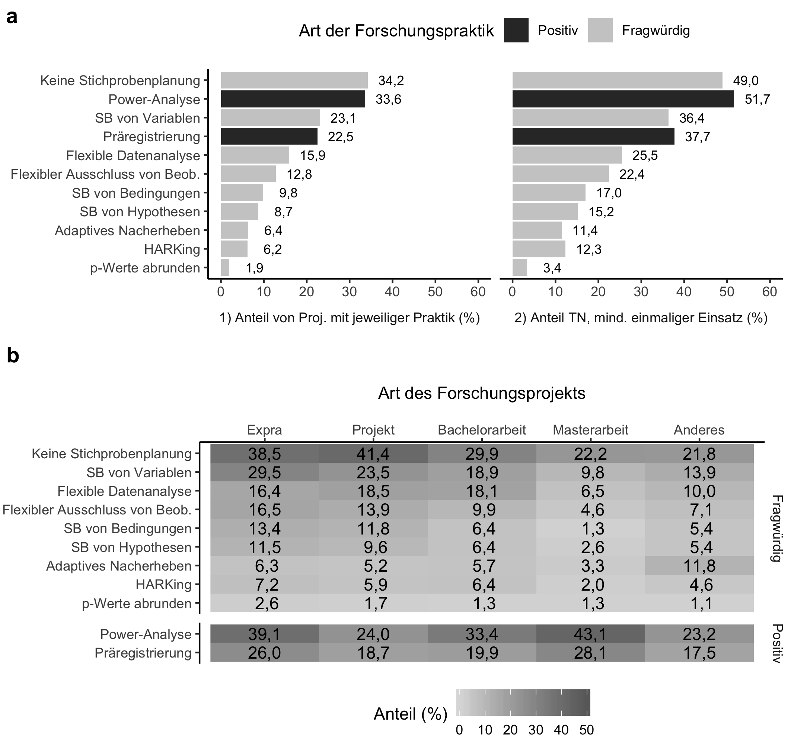
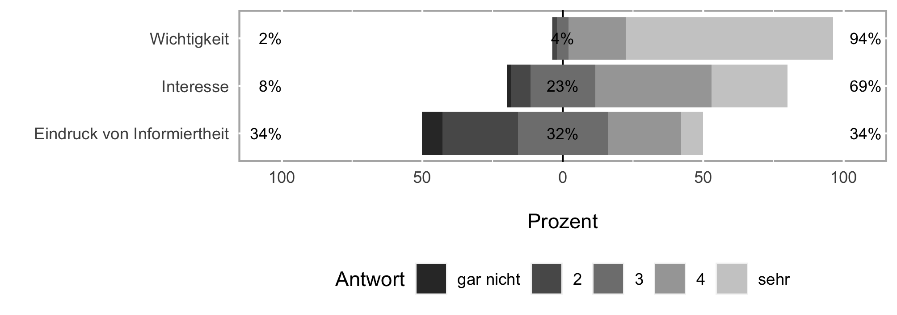

```{r setup, include=FALSE}
knitr::opts_chunk$set(echo = FALSE)
```

```{r imports, include=FALSE}
# functions, packages and static values
source("code/helpers/packages.R")
source("code/helpers/helper_functions.R")
source("code/helpers/static.R")
library(readxl)

# data
wide <- read_csv("data/wide.csv") %>% only_psych()
long <- read_csv("data/long.csv", col_types = cols(study_stage_open = col_character())) %>% 
  only_psych()

# results
b2 <- readRDS("data/block2_results.rds") # descriptives for question block 2
b3 <- readRDS("data/block3_results.rds") # descriptives for question block 3
ex <- readRDS("data/exploration.rds") # explorative analyses
excl <- readRDS("data/exclusions.rds")

# excel sheets
rp_overview <- read_excel("misc/practices_texts.xlsx")
```


```{r global variables, include=FALSE}
fnt <- "Arial"
lbreak <- ""
tab.counter <- 0
rounding_number <- 1 # for percentages
online.suppl <- "placeholder"
link <- glue("[{online.suppl}]({online.suppl})")
tables <- list()
```

```{r observation numbers, include=FALSE}
n.all <- wide %>% nrow()
n.emp <- wide %>% filter(emp_experience == "Yes") %>% nrow()

n.allproj <- long %>% distinct(id, project, project_conducted) %>%
  pull(project_conducted) %>% sum()

n.all_clear_uni <- long %>% 
  filter(project_conducted) %>% 
  filter(uni_project != "_unclear") %>%
  distinct(id) %>% nrow()

n.unclearproj <- long %>% 
  filter(project_conducted) %>% 
  filter(uni_project == "_unclear") %>% 
  distinct(id, project) %>% nrow()

n.illog <- long %>% 
  filter(project_conducted) %>% 
  filter(is.na(rp_applied)) %>% 
  group_by(type_of_practice) %>% summarise(n = sum(illog_answ_subj)) %>% 
  pull(n)
names(n.illog) <- c("Open", "Questionable")

n.obs.qrp <- long %>% filter(project_conducted) %>% 
  filter(type_of_practice == "Questionable") %>% nrow()

n.obs.orp <- long %>% filter(project_conducted) %>% 
  filter(type_of_practice == "Open") %>% nrow()

n_qrp.expra.bsc <- long %>% filter(project_conducted) %>% 
  filter(project %in% c("thesis.bsc", "emp.intern")) %>% 
  filter(type_of_practice == "Questionable")

n_orp.expra.bsc <- long %>% filter(project_conducted) %>% 
  filter(project %in% c("thesis.bsc", "emp.intern")) %>% 
  filter(type_of_practice == "Open")

nproj.qrp.lin <- long %>% filter(project_conducted) %>% 
  filter(type_of_practice == "Questionable") %>% 
  filter(project %in% c("emp.intern", "thesis.bsc", "thesis.msc")) %>% 
  distinct(id, project) %>% nrow()

nproj.orp.lin <- long %>% filter(project_conducted) %>% 
  filter(type_of_practice == "Open") %>% 
  filter(project %in% c("emp.intern", "thesis.bsc", "thesis.msc")) %>% 
  distinct(id, project) %>% nrow()
```

```{r extracting values, include=FALSE}
# question 1: 
n_qrps <- b2$q01 %>% filter(type_of_practice == "Questionable") %>% pull(m) %>% co()
sd_qrps <- b2$q01 %>% filter(type_of_practice == "Questionable") %>% pull(sd) %>% co()

# question 2:
q02 <- b2$q02

n.q.emp <- q02 %>% 
  filter(project == "emp.intern", type_of_practice == "Questionable") %>% 
  pull(mean) %>% co()

n.q.ma <- q02 %>% 
  filter(project == "thesis.msc", type_of_practice == "Questionable") %>% 
  pull(mean) %>% co()

n.q.ba <- q02 %>% 
  filter(project == "thesis.bsc", type_of_practice == "Questionable") %>% 
  pull(mean) %>% co()

n.q.proj <- q02 %>% 
  filter(project == "project", type_of_practice == "Questionable") %>% 
  pull(mean) %>% co()

n.q.o <- q02 %>% 
  filter(project == "other", type_of_practice == "Questionable") %>% 
  pull(mean) %>% co()

# question 3
q03 <- b2$q03
q04 <- b2$q04
q05 <- b2$q05

sh.samp <- q05 %>% filter(practice == "No Sample Planning") %>% 
  pull(share) %>% cop()

sh.srv <- q05 %>% filter(practice == "SR of Variables") %>% 
  pull(share) %>% cop()

sh.roundp <- q05 %>% filter(practice == "Rounding p-Values") %>% 
  pull(share) %>% cop()

sh.flexsamp <- q05 %>% filter(practice == "Flexible Sample Size") %>% 
  pull(share) %>% cop()

sh.pow <- q05 %>% filter(practice == "Power Analysis") %>% 
  pull(share) %>% cop()

sh.reg <- q05 %>% filter(practice == "Preregistration") %>% 
  pull(share) %>% cop()

sh.flexex <- q05 %>% filter(practice == "Flexible Exclusion") %>% 
  pull(share) %>% cop()

sh.src <- q05 %>% filter(practice == "SR of Conditions") %>% 
  pull(share) %>% cop()

sh.hark <- q05 %>% filter(practice == "HARKing") %>% 
  pull(share) %>% cop()

# --- USED ONCE --- #
sh2.samp <- q03 %>% filter(practice == "No Sample Planning") %>% 
  pull(share) %>% cop()

sh2.srv <- q03 %>% filter(practice == "SR of Variables") %>% 
  pull(share) %>% cop()

sh2.roundp <- q03 %>% filter(practice == "Rounding p-Values") %>% 
  pull(share) %>% cop()

sh2.flexsamp <- q03 %>% filter(practice == "Flexible Sample Size") %>% 
  pull(share) %>% cop()

sh2.pow <- q03 %>% filter(practice == "Power Analysis") %>% 
  pull(share) %>% cop()

sh2.nopow <- cop(100-(q03 %>% filter(practice == "Power Analysis") %>% 
  pull(share)))

sh2.reg <- q03 %>% filter(practice == "Preregistration") %>% 
  pull(share) %>% cop()

sh2.noreg <- cop(100-(q03 %>% filter(practice == "Preregistration") %>% 
  pull(share)))

sh2.flexex <- q03 %>% filter(practice == "Flexible Exclusion") %>% 
  pull(share) %>% cop()

sh2.src <- q03 %>% filter(practice == "SR of Conditions") %>% 
  pull(share) %>% cop()

sh2.hark <- q03 %>% filter(practice == "HARKing") %>% 
  pull(share) %>% cop()

```

<!-- Table definitions -->
<!-- The tables for den mixed models are defined in the results section. -->

```{r tab.rp_overview}
tab.counter <- tab.counter + 1 # counter increases automatically
tab.rp_overview <- tab.counter # individual counter for table

cap <- "Abgefragte Forschungspraktiken und Begleittexte."

tab.rp_overview.print <- rp_overview %>% 
  mutate(kurz = ifelse(!is.na(kurz), paste0("(", kurz, ")"), NA)) %>% 
  unite(col = "Bezeichnung (kurz)", lang, kurz, sep = " ") %>% 
  mutate_at(1, str_remove, pattern = " NA") %>% 
  flextable() %>% 
  width(1, width = 2.5) %>% 
  width(2, width = 4.5) %>% 
  flextable::font(fontname = "Times", part = "all") %>% 
  fontsize(j = 2, size = 10, part = "body") %>% 
  align(align = "left", part = "all") %>% 
  merge_at(i = 1, j = 1:2) %>% 
  merge_at(i = 11, j = 1:2) %>% 
  bold(i = c(1, 11), part = "body") %>% 
  flextable::font(fontname = fnt, part = "all") %>% 
  set_caption(glue("Tabelle {tab.counter}. {cap}"))

tables[[tab.counter]] <- tab.rp_overview.print
```

```{r tab.cor}
tab.counter <- tab.counter + 1
tab.cor <- tab.counter

c <- wide %>% #distinct(id, .keep_all = TRUE) %>% 
  select(age, semester, importance, felt_information, interest, n_projects) %>% 
  as.matrix() %>% rcorr()

tcor <- format_cor(c, names = n.cor, bonferroni = T)

a0 <- tcor$alpha
a <-  a0 %>% quick.p()
b <- ifelse(a0[1] == 0.05, "", " (adjustierte Alpha-Niveaus nach Bonferroni)")
p_exp <- glue("Markierungen: * p < {a[1]}, ** p < {a[2]}, *** p < {a[3]}{b}")

tab.cor.print <- tcor$table %>% 
  mutate_at(2:7, str_replace, pattern = "\\.", replacement = ",") %>% 
  flextable() %>% 
  align(j = 2:7, align = "center", part = "header") %>% 
  align(j = 2:7, align = "left", part = "body") %>% 
  autofit() %>% 
  add_footer_lines(p_exp) %>% 
  footnote(i = 6, j = 1, value = as_paragraph("Anzahl der von der/dem jeweiligen Teilnehmenden begonnenen oder durchgeführten Projekte."), ref_symbols = "a", part = "body") %>% 
  flextable::font(fontname = fnt, part = "all") %>% 
  set_caption(glue("Tabelle {tab.counter}. Korrelationen zwischen numerischen Variablen."))

tables[[tab.counter]] <- tab.cor.print
```

```{r tab.rcL, echo=FALSE}
tab.counter <- tab.counter + 1 # counter increases automatically
tab.rcL <- tab.counter # individual counter for table

cap <- glue::glue("Anteil von Teilnehmenden, die in der jeweiligen Lehrveranstaltung an ihrer aktuellen (Alumni: letzten) Universität eine Thematisierung der Replikationskrise erfahren haben (N = {nrow(wide)}).")

tab.rcL.print <- b3$rc_teaching_specific_share %>% 
  mutate(lecture = recode(lecture,
                         "Methods, Stats, Expra" = "Methodenlehre, Statistik, Expra",
                         "Social Psychology" = "Sozialpsychologie",
                         "General Psychology" = "Allgemeine Psychologie",
                         "Introductory Class" = "Einführungsveranstaltung",
                         "Diagnostics" = "Diagnostik",
                         "Differential Psychology" = "Differentielle Psychologie",
                         "Other" = "Andere",
                         "Clinical Psychology" = "Klinische Psychologie",
                         "Biological- / Neuropsychology" = "Biologische / Neuropsychologie",
                         "Work, Organizational and Economic Psychology" = "Arbeits-, Betriebs- und Organisationspsychologie",
                         "Pedagogical Psychology" = "Pädagogische Psychologie",
                         "Developmental Psychology" = "Entwicklungspsychologie",
                         "Health Psychology" = "Gesundheitspsychologie",
                         "Media- / Communication Psychology" = "Medien- / Kommunikationspsychologie",
                         "Forensic" = "Forensische Psychologie")) %>% 
  mutate(share = share %>% co(nround = 1, nsmall = 1)) %>% 
  rename(`Lehrveranstaltung` = lecture,
         # n = count,
         `Anteil (%)` = share) %>%
  flextable() %>% 
  autofit() %>% 
  flextable::font(fontname = fnt, part = "all") %>% 
  set_caption(glue::glue("Tablle {tab.counter}. {cap}"))

tables[[tab.counter]] <- tab.rcL.print
```

```{r tab.qrpsL, echo=FALSE}
tab.counter <- tab.counter + 1 # counter increases automatically
tab.qrpsL <- tab.counter # individual counter for table

cap <- glue::glue("Anteil von Teilnehmenden, die an ihrer aktuellen (bei Alumni: letzten) Universität in mindestens einer Lehrveranstaltung eine kritische Betrachtung der jeweiligen Forschungspraktik erfahren haben (N = {nrow(wide)}).")

tab.qrpsL.print <- b3$qrps_teaching_share %>% 
  mutate(qrp = recode(qrp,
                         "HARKing" = "HARKing",
                         "No Sample Planning" = "Keine Stichprobenplanung",
                         "SR of Variables" = "S.B. von Variablen",
                         "SR of Hypotheses" = "S.B. von Hypothesen",
                         "Flexible Sample Size" = "Flexible Stichprobengröße",
                         "Flexible Exclusion" = "Flexibler Ausschluss von Beob.",
                         "SR of Conditions" = "S.B. von Bedingungen",
                         "Flexible Analysis" = "Flexible Datenanalyse",
                         "Rounding p-Values" = "Runden von p-Werten",
                         "Not Sure" = "Nicht sicher",
                         "None" = "Keine"
                         )) %>% 
  mutate(share = share %>% co(nround = 1, nsmall = 1)) %>% 
  rename(`Fragwürdige Forschungspraktik` = qrp,
         `Anteil (%)` = share) %>% 
  flextable() %>% 
  autofit() %>% 
  flextable::font(fontname = fnt, part = "all") %>% 
  set_caption(glue::glue("Tablle {tab.counter}. {cap}"))

tables[[tab.counter]] <- tab.qrpsL.print
```

\newpage

In den letzten Jahren hat sich innerhalb der Psychologie eine intensive Auseinandersetzung mit den Auswirkungen der Replikationskrise sowie den daraus nötigen Weiterentwicklung der Disziplin ereignet. Als ein Grund für die mangelnde Replizierbarkeit psychologischer Forschung wurden die Verwendung fragwürdiger Forschungspraktiken (eng.  QRPs), identifiziert. Während es umfangreiche Untersuchungen zur Verbreitung von QRPs unter Wissenschaflter und Wissenschaflerinnen gibt, ist bisher wenig über die Prävalenz dieser Praktiken unter Studierenden bekannt. In der hier vorgestellten Arbeit wurde daher erstmals eine systematische Befragung unter 1398 Psychologie-Studierenden im deutschsprachigen Raum durchgeführt, um die Verbreitung von QRPs in empirischen Projekten sowie den aktuellen Stand der akademischen Lehre in Bezug auf die Replikationskrise und Open Science zu erheben. Die gemeinsame Betrachtung der Lehre und des Einsatzes fragwürdiger Forschungspraktiken versprechen Aufschluss darüber, wie die psychologische Lehre und das empirische Vorgehen von Studierenden miteinander zusammenhängen. Die Ergebnisse zeigen, dass fragwürdige Forschungspraktiken auch im Studium verbreitet sind, wobei sich die Prävalenz stark zwischen verschiedenen QRPs und verschiedenen Projektentypen unterscheidet. Unsere Daten geben Hinweise darauf, dass die Verbreitung von QRPs über den Studienverlauf abnimmt. Zudem ist ein Großteil der Studierenden bereits mit der Thematik der Replikationskrise in der Lehre in Berührung gekommen. Deren Behandlung findet größtenteils in der Methodenlehre und weniger in inhaltlich spezialisierten Fächern statt. Auf Basis dieser und weiterer Erkenntnisse benennt die Arbeit abschließend Handlungsempfehlungen für die Weiterentwicklung der psychologischen Lehre, in der die Prinzipien der Offenheit, Transparenz und Kollaboration beim Hervorbringen inhaltlich robuster Forschung bereits während Studium im Vordergrund stehen.

\newpage

# Einleitung

Die Nachrichten von der sogenannten Replikationskrise in der Psychologie haben innerhalb der Disziplin in den letzten Jahren hohe Wellen geschlagen. Verschiedene, groß angelegte Projekte wurden zur Untersuchung der Reproduzierbarkeit psychologischer Forschung durchgeführt: Die @OpenScienceCollaboration2015 schätzte in einer ersten systematischen Untersuchung anhand von 100 Studien aus drei einflussreichen Journals die Reproduzierbarkeit auf einen Wert zwischen 36 % (erfolgreiche Replikationen nach übereinstimmenden oder kleineren p-Werten)  und 68 % (signifikanter meta-analytischer Effekt) der untersuchten Studien. Im Projekt Many Labs 2, in dem 28 Effekte durch über 60 internationale Forschungsgruppen repliziert wurden, fanden @Klein2018 eine Rate von 54 % erfolgreichen Replikationen. In einer weiteren Untersuchung konnten @Camerer2018 nur 13 von 21 (62 %) in Nature und Science veröffentlichte psychologische Studien erfolgreich replizieren.

Zahlreiche Publikationen in der Psychologischen Rundschau, darunter zur Inflation von falsch-positiven Befunden [@Ulrich2016], zum Umgang mit Forschungsdaten [@Schoenbrodt2017]  und schließlich das Themenheft Replizierbarkeit [@Klauer2018], spiegeln die Relevanz des Themas für unsere Disziplin wider. Auch innerhalb der Studierendenschaft gewann das Thema jüngst an Relevanz: 2018 wurde auf der 27. PsyFaKo (Psychologie-Fachschaften-Konferenz[^psyfako]) in Würzburg ein Positionspapier zur Replikationskrise der Psychologie [@Psyfako2018] verabschiedet, in dem die Studierenden unter anderem forderten, dass die Themen Replikationskrise und Open Science einen größeren Stellenwert in der Lehre erhalten. Die Studierenden von heute werden das Fach Psychologie in Zukunft prägen und entsprechend wichtig ist es, dass das Studium durch eine sorgfältige und zeitgemäße Ausbildung eine angemessene Vorbereitung auf die vielfältigen beruflichen Tätigkeiten von Psycholog*innen darstellt.

[^psyfako]: Die PsyFaKo bildet die Interessenvertretung der deutschen Psychologiestudierenden. Auf der einmal pro Semester stattfindenden Konferenz versammeln sich Fachschaftsdelegationen aus dem deutschsprachigen Raum, um sich zu vernetzen, sich über aktuelle Entwicklungen im Fach Psychologie auszutauschen und um Positionspapiere zu verabschieden. Die Autor*innen dieses Berichts sind Teil der Arbeitsgruppe “Open Science”, die auf der 27. PsyFaKo in Würzburg (2018) gegründet wurde.

Die vorhandenen Untersuchungen zur Replikationskrise und Open Science beziehen sich primär auf die Art und Weise, wie in der Psychologie Erkenntnisse generiert und welche Forschungsmethoden  angewendet werden. Inwiefern diese Themen auch im Rahmen der akademischen Lehre vermittelt werden, stand bisher nicht im Fokus der Debatte.  In der hier vorgestellten Arbeit wurde erstmals eine systematische Befragung unter Psychologie-Studierenden im deutschsprachigen Raum durchgeführt, die die Thematisierung der Replikationskrise in der Lehre, die Verwendung fragwürdiger Forschungspraktiken (questionable research practices, QRPs) in empirischen Projekten während des Studiums untersucht. Die gemeinsame Betrachtung der Lehre und des Einsatzes fragwürdiger Forschungspraktiken versprechen Aufschluss darüber, wie die psychologische Lehre und das empirische Vorgehen von Studierenden miteinander zusammenhängen.

Fragwürdige Forschungspraktiken rückten im Rahmen der Replikationskrise als eine möglich Ursache für die mangelnde Replizierbarkeit von psychologischen Effekten in den Fokus [siehe z.B. @Simmons2011]. Als QRPs gelten Methoden, wie z.B. das nachträgliche Ausschließen von Ausreißern oder das selektive Berichten von Variablen. Diese erhöhen die Wahrscheinlichkeit von falsch-positiven Befunden [@Simmons2011]. Die Anwendung von QRPs beeinträchtigt die Verlässlichkeit psychologischer Befunde und unterminiert die empirische Basis der  Wissenschaft. Während die Verbreitung von QRPs innerhalb der Wissenschaftsgemeinschaft mehrfach untersucht wurde [u.a. @John2012; @Fiedler2016], ist uns zur Prävalenz von QRPs unter Studierenden nur eine Untersuchung bekannt [@Krishna2018a]. Die darin ermittelten Prävalenzraten für die Anwendung von QRPs in studentischen Abschlussarbeiten sind mit konservativen Schätzungen der Prävalenzraten unter Wissenschaftler*innen vergleichbar. Ferner wurde die Verwendung von QRPs durch die Einstellungen der Studierenden, die sowohl direkt als auch indirekt mit den die Einstellungen der betreuenden Dozierenden zusammenhängt wird, beeinflusst. 

Als eine mögliche Ursache für die verbreitete Anwendung von QRPs durch Forschende werden häufig die aktuellen Anreizstrukturen des Wissenschaftsbetriebs, die sich im Schlagwort “Publikationsdruck” manifestieren, genannt [siehe z.B. @Bakker2012]. Umso spannender war für uns die Frage, welche QRPs von Studierenden, die diesem Anreizsystem in geringerem Maß unterliegen sollten, verwendet werden, und ob sich deren Vorkommen über die im Laufe des Studiums zu absolvierenden empirischen Arbeiten (Seminar-, Bachelor-, Masterarbeit, etc.) verändert.

Die von uns durchgeführte Umfrage besteht aus drei Teilbereichen, deren Ergebnisse  einen Einblick in 1) die Verbreitung fragwürdiger und positiver Forschungspraktiken durch Studierende der Psychologie, 2) die Verankerung des Themenkomplexes “Replikationskrise, QRPs und Open Science” in der Lehre sowie 3) die Einstellung der Studierenden zu diesem Themenkomplex, bieten.


# Methode
Die Umfrage wurde auf dem “Open Science Framework” (OSF) präregistriert ([osf.io/k85r4/](https://osf.io/k85r4/)). Über diese Plattform sind auch unsere Primärdaten in anonymisierter Form zu finden ([osf.io/t3mak/](https://osf.io/t3mak/)). Die Online-Umfrage wurde mit der Open-Source Software formR [@Arslan2019] erstellt und die Daten in R mit Hilfe der Pakete lme4, lmerTest and der *tidyverse*-Pakete [@Bates2015; @Kuznetsova2017; @RCoreTeam2019; @Wickham2017] aufbereitet und analysiert.
Im Vorfeld wurde eine Pilotbefragung mit 22 Psychologie-Studierenden verschiedener Fachsemester durchgeführt, um die Verständlichkeit und Durchführbarkeit der Befragung zu testen. Hierbei hatten die Befragten die Gelegenheit, mittels offener Kommentarfelder ausführliches Feedback abzugeben, das in der finalen Version der Umfrage berücksichtigt wurde.

**Akquise**. Die Bewerbung der Umfrage erfolgte durch Kontaktpersonen aus den Fachschaften der deutschsprachigen Universitäten. Vereinzelt wurden auch Dozierende angesprochen, die in ihren Veranstaltungen auf die Umfrage hinwiesen.

```{r}
ex.ok <- excl$fin - excl$ok
ex.stu <- excl$ok - excl$students
ex.psy <- excl$age - excl$psych
ex.ger <- excl$students - excl$ger
ex.age <- excl$ger - excl$age

ex.emp <- excl$psych - excl$emp

ex.prereg <- sum(ex.ok, ex.stu, ex.psy)
ex.new <- sum(ex.ger, ex.age)
```


**Ausschlüsse**. Im präregistrierten Erhebungszeitraum vom 22.11.2018 bis 28.02.2019 klickten `r excl$in_period` Personen auf den Link zu unserer Umfrage, hiervon bearbeiteten `r excl$fin` Personen (`r cop((excl$fin / excl$in_period)*100)`) alle Fragen. Insgesamt wurden `r ex.prereg` Personen anhand vorab präregistrier Kriterien von der Analyse ausgeschlossen: Acht Personen gaben an, nicht ernsthaft teilgenommen zu haben, `r ex.stu` Personen hatten ihren Studienabschluss 2016 oder früher gemacht und zählten damit für uns nicht mehr zu aktuell oder kürzlich Studierenden, und `r ex.psy` Personen waren keine Psychologie-Studierenden oder -Absolvent\*innen. Abweichend von der Präregistrierung schlossen wir auch `r ex.age` Personen aus, die ein unplausibles Alter angegeben hatten (16 oder jünger, trotz fortgeschrittenen Studiums). Zudem berücksichtigten wir eine\*n Teilnehmer\*in von einer niederländischen Universität nicht in der Auswertung, da sich unsere Umfrage explizit auf den deutschsprarchigen Raum richtete. Für die Analyse unserer Fragen zum Einsatz von QRPs wurden außerdem `r ex.emp` Teilnehmer*innen nicht berücksichtigt, die noch nie ein empirisches Projekt in ihrem Studium durchgeführt hatten. Von den in diesem Schritt ausgeschlossenen Teilnehmenden waren 97,6 % Studierende im 1. oder 2. Bachelor-Semester. Wir bezeichnen diese Teilstichprobe im Folgenden als EE (Empirische Erfahrung)-Teilstichprobe. So blieben `r n.all` Personen in der vollen Stichprobe und `r n.emp` Personen in der EE-Teilstichprobe.

(( Abbildung 1 ungefähr hier platzieren. ))

```{r}
gender <- wide %>% only_psych() %>% 
  group_by(sex) %>% summarise(share = (n() / nrow(.))*100) %>% 
  spread(key = sex, value = share) %>% 
  rename(noanswer = `no answer`)

age <- wide %>% only_psych() %>% pull(age)

phase <- wide %>% only_psych() %>% 
  group_by(study_stage_mc) %>% summarise(share = (n() / nrow(.))*100) %>% 
  spread(key = study_stage_mc, value = share) %>% 
  rename(alumni = `I don't study (any more)`)

uni.ma <- wide %>% only_psych() %>% 
  pull(uni_current) %>% unique()

uni.bsc <- wide %>% only_psych() %>% 
  pull(uni_bachelor) %>% unique()

n.uni <- c(uni.ma, uni.bsc) %>% unique() %>% na.omit()

n.uni30 <- sum(!(n.uni %in% as.character(1:50)))

```


**Stichprobenbeschreibung (volle Stichprobe)**. Unsere Umfrageteilnehmer*innen (weiblich: `r gender$female %>% cop()`; männlich: `r gender$male %>% cop()`; divers: `r gender$diverse %>% cop()`; keine Angabe: `r gender$noanswer %>% cop()`) waren im Mittel `r age %>% mean() %>% co()` Jahre alt (SD = `r age %>% sd() %>% co()`) und Psychologiestudierende in allen Phasen ihres Studiums (s. Abbildung 1). Es nahmen mehr Bachelor- als Masterstudierende teil (`r phase$Bachelor %>% cop()` zu `r phase$Master %>% cop()`). Der Anteil von Alumni/Alumnae war mit `r phase$alumni %>% cop()` gering. In der Stichprobe sind Teilnehmende von `r n.uni %>% length()` deutschsprachigen staatlichen und privaten Hochschulen und Universitäten vertreten. Für `r n.uni30` Hochschulen lagen uns 30 oder mehr Datenpunkte vor.

**Prozedur und Fragen**. Teilnehmende beantworteten zunächst demographische Fragen (Alter, Geschlecht, Studienfortschritt, aktuelle Universität, bei Master-Studierenden auch Bachelor-Universität, ggf. Jahr des Abschlusses). Angezeigte Fragen mussten, wenn hier nicht anders angegeben, als Pflichtfragen beantwortet werden. Anschließend  folgten Fragen zur Verwendung von fragwürdigen und positiven Forschungspraktiken in empirischen Projekten während des Studiums. Zunächst beantworteten die Teilnehmenden die Frage “Hast du schon einmal ein empirisches[^emp]  Forschungsprojekt in deinem gesamten bisherigen Studienverlauf (d.h. inkl. Bachelor und Master) durchgeführt oder begonnen (z.B. Expra/Empra, Projektarbeit, Bachelorarbeit, Masterarbeit)?” (Antwortmöglichkeiten: “Ja” / “Nein”). Bei Beantwortung mit “Nein” sprang die Umfrage zum nächsten Fragenblock (kritische Thematisierung von QRPs in der Lehre). Bei Beantwortung mit “Ja” folgten die Fragen zur Verwendung spezifischer Forschungspraktiken: “Welche der unten genannten Forschungspraktiken hast du selbst bzw. hat deine Seminargruppe schon mindestens einmal bei einem empirischen Projekt an deiner Universität unter Anleitung einer Lehrperson angewendet oder wendest sie aktuell an?” (Antwortmöglichkeiten: “Expra / Empra”, “Projektarbeit”[^proj], “Bachelorarbeit”, “Masterarbeit”, “Anderes”[^other], “Keines”). Zu jeder Praktik gab es einen Info-Text mit einem erklärenden Beispiel. Die abgefragten Praktiken und die Info-Texte sind in Tabelle 1 aufgelistet. Zusätzlich wurde gefragt, welche Plattformen die Teilnehmenden mindestens einmal für Präregistrierungen verwendet hatten (Antwortmöglichkeiten: “Lehrperson nahm Präregistrierung entgegen”, “aspredicted.org”, “osf.io”, “bei einem Journal”, “Sonstiges”, “Ich habe noch nie präregistriert”). 

[^emp]: Zusätzlich angezeigter Info-Text bei Mouse-Over: “D.h. es wurden Daten erhoben oder ausgewertet. Nicht empirisch wäre z.B. eine reine Literaturarbeit.”
[^proj]:  Zusätzlich angezeigte Begriffserklärung: “Bspw. Arbeit an einer Studie im Rahmen eines Seminars”
[^other]:  Zusätzlich angezeigte Begriffserklärung: “Bspw. Forschungspraktikum oder Hiwi-Job”

Für neun QRPs (siehe Tabelle 1) wurde abgefragt, ob diese Praktik an der aktuellen Hochschule in der Lehre kritisch thematisiert wurde (Antwortmöglichkeiten: “Ja”, “Nein”, “Weiß nicht”). Außerdem fragten wir die Teilnehmenden, ob (Antwortmöglichkeiten: “Ja”, “Nein”, “Weiß nicht”) und in welchen Veranstaltungen die Replikationskrise an ihrer aktuellen Hochschule thematisiert wurde (Antwortmöglichkeiten: Auswahl 14 üblicher psychologischer Fächer und “Sonstige”, genaue Liste siehe Online-Materialien ( `r link`). Anschließend beantworteten die Teilnehmenden die drei Fragen “Wie sehr interessiert dich der Themenkomplex fragwürdige Forschungspraktiken, Open Science und die Replikationskrise?”, “Wie wichtig ist es deiner Meinung nach, dass der Themenkomplex fragwürdige Forschungspraktiken, Open Science und Replikationskrise im Studium gelehrt wird?” und “Wie gut fühlst du dich über den Themenkomplex fragwürdige Forschungspraktiken, Open Science und die Replikationskrise informiert?”, jeweils auf einer Skala von 1 (“Gar nicht”) bis 5 (“Sehr”). Es folgten noch wenige zusätzliche Fragen, die wir aus Gründen der Prägnanz hier nicht berichten. Sie können in der Präregistrierung und den zusätzlichen Online-Materialien nachvollzogen werden (`r link`). Die Umfrage schloss mit der Kontrollfrage “Hast du ernsthaft an dieser Umfrage teilgenommen?” (“Ja” / “Nein”) und einem optionalen freien Kommentarfeld.

(( Tabelle 1 ungefähr hier platzieren. ))


# Ergebnisse

## Deskriptive Ergebnisse
### Verbreitung fragwürdiger Forschungspraktiken

Den Ergebnissen in diesem Abschnitt liegen die Daten der EF (Empirische Erfahrung)-Teilstichprobe (N = `r n.emp`) zugrunde.

**Unterschiede zwischen Projekten**. Aus den Angaben der Teilnehmenden ergibt sich ein mittlerer Einsatz von `r n_qrps` (SD = `r sd_qrps`) QRPs pro Projekt. Wie in Abbildung \@ref(fig:nqrps) zu sehen ist, zeigen sich dabei Unterschiede zwischen den abgefragten Projekten. Besonders viele fragwürdige Praktiken scheinen demnach mit durchschnittlich `r n.q.emp` (SD = `r q02 %>% filter(project == "emp.intern", type_of_practice == "Questionable") %>% pull(sd) %>% co()`) Praktiken pro Projekt im Expra verwendet zu werden, während Masterarbeiten mit durchschnittlich `r n.q.ma` (SD = `r q02 %>% filter(project == "thesis.msc", type_of_practice == "Questionable") %>% pull(sd) %>% co()`) verwendeten QRPs den niedrigsten Wert aufweisen. Bachelor- und Projektarbeiten sowie andere Projekte (durchschnittlich jeweils `r n.q.ba` (SD = `r q02 %>% filter(project == "thesis.bsc", type_of_practice == "Questionable") %>% pull(sd) %>% co()`), `r n.q.proj` (SD = `r q02 %>% filter(project == "project", type_of_practice == "Questionable") %>% pull(sd) %>% co()`) und `r n.q.o` (SD = `r q02 %>% filter(project == "other", type_of_practice == "Questionable") %>% pull(sd) %>% co()`) QRPs pro Projekt) liegen dazwischen. Weitere Details (Median, Minimum und Maximum) sind in den Online-Materialien (`r link`) zu finden. Betrachtet man die Projekte, die sich eindeutig nach Studienfortschritt ordnen lassen, also Expra, Bachelorarbeit und Masterarbeit, so zeigt sich ein deutlicher Trend: Mit fortschreitendem Studium wurden immer weniger fragwürdige Forschungspraktiken von den Teilnehmenden eingesetzt.

(( Abbildung \@ref(fig:nqrps) ungefähr hier platzieren. ))

```{r}
pre.count.lec <- b2$prereg_data %>% 
  filter(names_prereg_where == "lecturer") %>% pull(prereg_counts)

pre.count.osf <- b2$prereg_data %>% 
  filter(names_prereg_where == "osf.io") %>% pull(prereg_counts)

pre.count.aspredicted <- b2$prereg_data %>% 
  filter(names_prereg_where == "aspredicted.org") %>% pull(prereg_counts)

pre.count.other <- b2$prereg_data %>% 
  filter(names_prereg_where == "other") %>% pull(prereg_counts)

pre.count.jou <- b2$prereg_data %>% 
  filter(names_prereg_where == "journal") %>% pull(prereg_counts)

pre.count.never <- b2$prereg_data %>% 
  filter(names_prereg_where == "never perergistered") %>% pull(prereg_counts)
```

**Unterschiede zwischen Praktiken**. Auf der linken Seite von Abbildung \@ref(fig:rpdetails)a ist die Einsatzhäufigkeit der einzelnen abgefragten Forschungspraktiken dargestellt. Die am häufigsten genannten Praktiken waren “fehlende Stichprobenplanung” und “selektives Berichten abhängiger Variablen” mit einem Anteil von `r sh.samp` , bzw. `r sh.srv` betroffenen Projekten. Die von den Teilnehmenden am seltensten eingesetzten Praktiken waren das Abrunden von p-Werten und das Nacherheben von Versuchspersonen zum Zweck der Herbeiführung statistischer Signifikanz mit `r sh.roundp`, bzw. `r sh.flexsamp` betroffenen Projekten. Neben fragwürdigen wurden als positive Forschungspraktiken auch abgefragt, ob in den jeweiligen Projekten eine Stichprobenumfangsplanung (basierend auf einer a-priori Poweranalyse) und eine Präregistrierung durchgeführt wurden. Laut Angaben der Teilnehmenden wurde für `r sh.pow` der erfassten Projekte eine Power-Analyse zur Stichprobenplanung durchgeführt, und `r sh.reg` der erfassten Projekte wurden präregistriert. Eine detailliertere Aufschlüsselung dieser Ergebnisse nach Forschungsprojekt ist in Abbildung \@ref(fig:rpdetails)b dargestellt. Auf der rechten Seite von Abbildung \@ref(fig:rpdetails)a ist analog zur Darstellung von John, Loewenstein und Prelec (2012) der Anteil der Teilnehmenden zu sehen, die die jeweilige Forschungspraktik mindestens einmal in einem empirischen Projekt eingesetzt hatten.

Präregistrierungen fanden mit `r pre.count.lec` Nennungen (`r ((pre.count.lec / n.emp)*100) %>% cop()` der Teilnehmenden) am häufigsten bei einer Lehrperson statt[^pre_lec]. Es folgten in absteigender Reihenfolge als Plattformen für Präregistrierungen das Open Science Framework (OSF, `r pre.count.osf` mal gewählt, `r ((pre.count.osf / n.emp)*100) %>% cop()` der Teilnehmenden), aspredicted.org (`r pre.count.aspredicted` mal gewählt, `r ((pre.count.aspredicted / n.emp)*100) %>% cop()` der Teilnehmenden), “andere” (`r pre.count.other` mal gewählt, `r ((pre.count.other / n.emp)*100) %>% cop()` der Teilnehmenden) und ein Journal (`r pre.count.jou` mal gewählt, `r ((pre.count.jou / n.emp)*100) %>% cop()` der Teilnehmenden). Von den Teilnehmenden gaben `r pre.count.never` Personen (`r ((pre.count.never / n.emp)*100) %>% cop()` der Teilnehmenden)  an, nie eines ihrer empirischen Projekte präregistriert zu haben. Bei dieser Frage war die Auswahl mehrerer Antworten erlaubt.

[^pre_lec]: Möglicherweise bezogen sich die Antworten unserer Teilnehmer*innen hier auch auf die üblichen Exposés, was die hohen Zahlen erklären würde.

### Zusätzliche Ergebnisse

Den Ergebnissen in diesem Abschnitt liegen die Daten der vollen Stichprobe (N = `r n.all`) zugrunde. Die einfachen Korrelationen zwischen den numerischen Variablen finden sich in Tabelle `r tab.cor`. Zu den hier dargestellten Ergebnissen finden sich ausführliche Tabellen mit allen Daten in den Online-Materialien (`r link`).

```{r additional results, echo=FALSE}
heard_of_rc <- b3$rc_teaching_general %>% 
  group_by(rc_teaching) %>% 
  mutate(n_sum = sum(n_semester)) %>%
  mutate(n_answer = sum(n)) %>% 
  mutate(share = (n_answer / n_sum) * 100) %>% 
  distinct(share, rc_teaching)

# a little wasteful workaround to get the correct number of students per
# study stage.
tmp <- wide %>% 
           group_by(study_stage_mc) %>% 
           summarise(n = n()) %>% 
  arrange(study_stage_mc) %>% 
  pull(n)

heard_of_rc_stage <- b3$rc_teaching_general %>% 
  arrange(study_stage_mc) %>% 
  mutate(n_sum = recode(study_stage_mc, 
                        "Bachelor" = tmp[1], 
                        "I don't study (any more)" = tmp[2], 
                        "Master" = tmp[3], 
                        "Other" = tmp[4])) %>% 
  group_by(rc_teaching, study_stage_mc) %>% 
  mutate(n_answer = sum(n)) %>% 
  mutate(share = (n_answer / n_sum) * 100) %>% 
  distinct(share, rc_teaching)
```

<!-- #### Behandlung der Replikationskrise in der Lehre  -->

**Thematisierung der Replikationskrise**. Insgesamt gaben `r heard_of_rc %>% filter(rc_teaching == "yes") %>% pull(share) %>% cop()` der Teilnehmenden an, dass die Replikationskrise an ihrer jeweils aktuellen Universität in Lehrveranstaltungen thematisiert wurde, `r heard_of_rc %>% filter(rc_teaching == "no") %>% pull(share) %>% co(nround = 1, nsmall = 1)` % gaben an, dass sie nicht thematisiert wurde ("Weiß nicht": `r heard_of_rc %>% filter(rc_teaching == "unsure") %>% pull(share) %>% co(nround = 1, nsmall = 1)` %). Unter den Studienanfänger\*innen (Studierende im ersten oder zweiten Bachelor-Semester) `r b3$rc_teaching_general %>% filter(study_stage_mc == "Bachelor" & semester == "1/2" & rc_teaching == "yes") %>% pull(share) %>% co(nround = 1, nsmall = 1)` % der Teilnehmenden an, in Lehrveranstaltungen von der Replikationskrise gehört zu haben. Für alle Studierenden im Bachelor und im Master zeigte sich im Allgemeinen jeweils ein ähnliches Bild mit `r heard_of_rc_stage %>% filter(study_stage_mc == "Bachelor" & rc_teaching == "yes") %>% pull(share) %>% co(nround = 1, nsmall = 1)` %, bzw. `r heard_of_rc_stage %>% filter(study_stage_mc == "Master" & rc_teaching == "yes") %>% pull(share) %>% co(nround = 1, nsmall = 1)` % positiven Antworten.

**Betrachtung nach Lehrveranstaltungen**. Tabelle `r tab.rcL` enthält eine Übersicht der Ergebnisse. Die Behandlung der Replikationskrise fand größtenteils in der Methodenlehre (inkl. Expra) statt: `r b3$rc_teaching_specific_share %>% filter(lecture == "Methods, Stats, Expra") %>% pull(share) %>% cop()` aller Teilnehmenden gaben an, dass hier die Replikationskrise thematisiert wurde. In der Lehre der Sozialpsychologie, der am stärksten im Fokus der Kritik stehenden Teildisziplin [siehe z.B. @Earp2015], wurde am zweithäufigsten über die Replikationskrise berichtet (`r b3$rc_teaching_specific_share %>% filter(lecture == "Social Psychology") %>% pull(share) %>% cop()`). In den 13 übrigen Fachbereichen (inkl. "Andere") bewegt sich die Abdeckung zwischen `r b3$rc_teaching_specific_share %>% filter(lecture == "General Psychology") %>% pull(share) %>% cop()` (Allgemeine Psychologie) und `r b3$rc_teaching_specific_share %>% filter(lecture == "Forensic") %>% pull(share) %>% cop()` (Forensische Psychologie). Dabei sollte beachtet werden, dass hochspezialisierte Module wie Forensische Psychologie wohl nur von einem Bruchteil der Befragten belegt wurden. Für solche spezialisierten Module sind die obigen Zahlen daher mit der Häufigkeit der Belegung konfundiert und sollten nur sehr zurückhaltend interpretiert werden. Für allgemeinere Module wie z.B. Sozialpsychologie gilt das nicht in gleichem Maße, da sie in der Regel Teil jedes Psychologie-Studiums sind.

**Behandlung fragwürdiger Praktiken**. Die Ergebnisse (s. Tabelle `r tab.qrpsL`) legen nahe, dass Studierende im Studium durchaus eine kritische Thematisierung einzelner fragwürdiger Forschungspraktiken erleben. So gaben `r b3$qrps_teaching_share %>% filter(qrp == "HARKing") %>% pull(share) %>% cop()` der Teilnehmenden an, eine Problematisierung von HARKing (Hypothesizing After the Results are Known, das Aufstellen von Hypothesen nach Kenntnis der Ergebnisse) erfahren zu haben. HARKing stellte sich als die am häufigsten in der Lehre thematisierte fragwürdige Forschungspraktik heraus. Auf den folgenden Plätzen finden sich fehlende Stichprobenplanung (`r b3$qrps_teaching_share %>% filter(qrp == "No Sample Planning") %>% pull(share) %>% cop()`) und selektives Berichten von Variablen (`r b3$qrps_teaching_share %>% filter(qrp == "SR of Variables") %>% pull(share) %>% cop()`). Am seltensten wurden Flexibilität in der Datenanalyse (`r b3$qrps_teaching_share %>% filter(qrp == "Flexible Analysis") %>% pull(share) %>% cop()`) und das Abrunden von p-Werten (`r b3$qrps_teaching_share %>% filter(qrp == "Rounding p-Values") %>% pull(share) %>% cop()`) kritisch thematisiert.

<!-- #### Einstellung von Studierenden -->

**Einstellungen von Studierenden**. Abbildung \@ref(fig:attitudes) zeigt die Einschätzung der Wichtigkeit des Themenkomplexes “Open Science und Replikationskrise” durch die Teilnehmenden, ihr Interesse daran und ihre Einschätzung dazu, wie gut sie über das Thema informiert sind. Deutlich wird, dass das Thema "Replikationskrise und Open Science" von der überwältigenden Mehrheit der Teilnehmenden für sehr wichtig oder wichtig gehalten wird, dass eine Mehrheit der Teilnehmenden Interesse an dem Thema hat, und dass sich ein substanzieller Teil der Teilnehmenden als nicht gut informiert einschätzte.

## Explorative Analysen

Zur näheren Untersuchung der Daten führten wir eine Reihe von explorativen Analysen durch, von denen wir die wichtigsten hier berichten. Alle weiteren oder nur kurz erwähnten Analysen sind in den Online-Materialien (`r link`) abrufbar. Die Analysen wurden in R mit dem Paket "lme4" ausgeführt [@RCoreTeam2019; @Bates2015]. Für alle Analysen wurden Bonferroni-korrigierte Alpha-Niveaus zugrunde gelegt.

### Einsatz fragwürdiger Forschungsmethoden

```{r tab.glmm.qrp, echo=FALSE}
# custom part
tab.counter <- tab.counter + 1 # counter increases automatically
tab.glmm.qrp <- tab.counter # individual counter for table
m <- ex$qrp$models$m3
pred.names <- na1

# reference levels of categorical data in table
kat <- paste(ref.sex, ref.stage, ref.osi_at_uni, ref.osi, ref.rc, ref.practice_taught, ref.proj, sep = ", ")

# abbreviations used in table
abk.tab <-  paste(abk.rk, abk.osi, abk.qrp, abk.sb, abk.sf, sep = ", ")

# table caption
cap <- "Modell zur Untersuchung der Zusammenhänge von Kovariaten mit dem Einsatz fragwürdiger Forschungspraktiken. Schätzungen der fixen Effekte. Abhängige Variable: Forschungspraktik angewendet (0 – Nein, 1 – Ja)."

# automatic part
d <- m %>% model.frame() %>% as_tibble() # 'raw' data for this table
t <- m %>% glmer_table(names = pred.names) # table data

a0 <- t$alpha # used alpha level
a <-  a0 %>% quick.p()
b <- ifelse(a0[1] == 0.05, "", " (adjustierte Alpha-Niveaus nach Bonferroni)")
p_exp <- glue("Markierungen: * p < {a[1]}, ** p < {a[2]}, *** p < {a[3]}{b}")

n.obsx <- d %>% nrow(); n.obs <- n.obsx %>% format(big.mark = ' ')
n.projx <- d %>% distinct(id, project) %>% nrow()
n.proj <- n.projx %>% format(big.mark = ' ')
n.subjx <- d %>% distinct(id) %>% nrow()
n.subj <- n.subjx  %>% format(big.mark = ' ')
n <- glue("Datenpunkte insg. = {n.obs}, Projekte = {n.proj}, Teilnehmende = {n.subj}")

ref <- paste0("Referenzkategorien: ", kat, ".\n")
abk <- abk.f(abk.glmer, abk.tab)

# table
tab.glmm.qrp.print <- t$table %>% 
  select(-1) %>% 
  mutate_at(c(2, 3, 4, 6), co) %>% 
  flextable() %>% 
  align(j = c(1, 7), align = "left", part = "body") %>% 
  align(j = c(1, 7), align= "left", part = "header") %>% 
  autofit() %>% 
  add_footer_lines(c(glue("Anmerkungen. {n}"), ref, abk, p_exp)) %>% 
  set_caption(glue("Tabelle {tab.counter}. {cap}")) %>% 
  flextable::font(fontname = fnt, part = "all") %>% 
  set_caption(glue("Tabelle {tab.counter}. {cap}")) %>% 
  identity()

tables[[tab.counter]] <- tab.glmm.qrp.print
```

```{r GLMM QRPs LR Tests, include=FALSE}
an1 <- ex$qrp$lr_tests$an1
an2 <- ex$qrp$lr_tests$an2

m0 <- ex$qrp$models$m0
m1a <- ex$qrp$models$m1a %>% VarCorr()
m1b <- ex$qrp$models$m1b %>% VarCorr()
m1c <- ex$qrp$models$m1c %>% VarCorr()

chi1.1 <- an1$Chisq[[2]] %>% co()
chi1.2 <- an2$Chisq[[2]] %>% co()
chi1.3 <- an2$Chisq[[3]] %>% co()

df1.1 <- an1$`Chi Df`[[2]]
df1.2 <- an2$`Chi Df`[[2]]
df1.3 <- an2$`Chi Df`[[3]]

p1.1 <- an1$`Pr(>Chisq)`[[2]] %>% printp()
p1.2 <- an2$`Pr(>Chisq)`[[2]] %>% printp()
p1.3 <- an2$`Pr(>Chisq)`[[3]] %>% printp()

sd1.1 <- m1c$id %>% as.numeric() %>% sqrt() %>% co()
sd1.2 <- m1c$uni_project %>% as.numeric() %>% sqrt() %>% co()
sd1.3 <- m1c$practice %>% as.numeric() %>% sqrt() %>% co()

betas <- summary(ex$qrp$models$m3)$coefficients %>% exp() %>% co()
```

In einem generalisierten linearen gemischten Modell für dichotome abhängige Variablen mit logit-Linkfunktion nahmen wir alle verfügbaren, potentiell informativen Kovariaten auf, um die Odds für den Einsatz fragwürdiger Forschungspraktiken zu modellieren. Abhängige Variable war ein Indikator dafür, ob eine spezifische Forschungspraktik in einem spezifischen Projekt eingesetzt wurde (0 = "Nein", 1 = "Ja"). Das Modell enthält zufällige Achsenabschnitte für den/die jeweilige/n Teilnehmer\*in (SD = `r sd1.1`, $\chi^2$ (`r df1.1`) = `r chi1.1`, `r p1.1`), für die Universität, an der das Projekt durchgeführt wurde (SD = `r sd1.2`, $\chi^2$ (`r df1.2`) = `r chi1.2`, `r p1.2`), und für die spezifische Forschungspraktik (SD = `r sd1.3`, $\chi^2$ (`r df1.3`) = `r chi1.3`, `r p1.3`). Die numerischen Prädiktoren wurden z-standardisiert. Die Schätzungen der fixen Koeffizienten und die jeweiligen Odds Ratios sind in Tabelle `r tab.glmm.qrp` dargestellt. Zugrunde lagen die Daten aus der EE-Teilstichprobe. 

Einzelne Beobachtungen wurden wegen inkonsistenter Antworten oder unklarer Zuordnung des jeweiligen Projektes zu einer Universität ausgeschlossen. Ersteres geschah in Fällen, in denen Teilnehmende bei der Frage nach der Anwendung einer spezifischen Forschungspraktik sowohl die Antwortmöglichkeit "Keines" (Praktik wurde in keinem Projekt verwendet), als auch mindestens ein oder mehrere Projekte auswählten (bei QRPs n = `r n.illog[2]` Beobachtungen). Zweiteres geschah bei den Projekten "Projektarbeit" und "Anderes", wenn die Teilnehmenden ihre Universität zwischen Bachelor und Master gewechselt hatten, oder bei Alumni/Alumnae, da deren Bachelor-Universität nicht erfasst wurde (n = `r n.unclearproj` Projekte). Zwischen beiden Kriterien gab es Überschneidungen. Insgesamt wurden so `r n.obs.qrp - n.obsx` Datenpunkte zu `r n.allproj - n.projx` Projekten von `r n.emp - n.subjx` Teilnehmenden in der Analyse nicht berücksichtigt.

Das Effektstärkemaß Odds Ratio gibt die multiplikative Änderung im Verhältnis der *Odds* (dt.: Chancen) von "Forschungspraktik angewandt" und "Forschungspraktik nicht angewandt" bei Änderung des Prädiktors um eine Einheit, bzw. bei kategorialen Prädiktoren im Vergleich zur Referenzgruppe an. Ein Odds Ratio größer als 1 bedeutet, dass die Anwendung der Forschungspraktik wahrscheinlicher wird, ein Odds Ratio unter 1, dass sie weniger wahrscheinlich wird. Zunächst lässt sich beobachten, dass QRPs umso weniger eingesetzt wurden, je eher Teilnehmende den Themenkomplex "Replikationskrise und Open Science" als wichtig ansahen und je eher sie sich als gut informiert einschätzten (Odds Ratios von `r betas["importance", 1]` und `r betas["felt_information", 1]`).

Darüber hinaus lassen sich Unterschiede zwischen den einzelnen Projekttypen erkennen, wobei alle Projekttypen im Vergleich zur Referenzkategorie "Expra" eine geringere Wahrscheinlichkeit des Einsatzes von QRPs aufweisen. Die Effektstärken variieren dabei von OR = `r betas["projectthesis.msc", 1]` (Masterarbeiten) bis OR = `r betas["projectproject", 1]` (Projektarbeit). Bei einer Masterarbeit ist die Chance, dass eine fragwürdige Forschungspraktik eingesetzt wird, also weniger als ein Drittel der Chance, dass sie in einem Expra eingesetzt wird. Die übrigen untersuchten Kovariaten wiesen keinen signifikanten Zusammenhang mit dem Einsatz von QRPs auf (siehe Tabelle `r tab.glmm.qrp`).

```{r GLMM QRPs linear, include=FALSE}
m <- ex$lin.qrp$models$m3
t <- m %>% glmer_table(names = na4a)
b <- t$table %>% filter(predictor == "project.L")
```

In einem nächsten Schritt untersuchten wir im Detail, ob sich Hinweise für eine systematische Veränderung der Einsatzwahrscheinlichkeit von QRPs im Verlauf des Studiums finden. Dazu betrachteten wir ausschließlich Expras, Bachelorarbeiten und Masterarbeiten, da diese Projekte eindeutig verschiedenen Phasen des Studiums zugeordnet werden können. Die Analyse wurde auch hier mit einem generalisierten linearen gemischten Modell für dichotome abhängige Variablen mit logit-Linkfunktion mit der gleichen abhängigen Variable und, abgesehen vom Projekttyp, den gleichen Kovariaten wie im vorherigen Modell durchgeführt. Der Projekttyp wurde nun als geordneter Faktor in das Modell mit aufgenommen, so dass ein linearer Trend über die drei eingeschlossenen Projekttypen untersucht werden konnte. Tatsächlich zeigte sich ein linearer Trend, OR = `r b[,5]` `r b[, 6]`, p `r str_replace(b[, 8], "\\*\\*\\*", "")`, der darauf hindeutet, dass mit fortschreitendem Studium, bzw. in anspruchsvolleren Projekten mit geringerer Wahrscheinlichkeit QRPs angewandt werden.

### Einsatz positiver Forschungspraktiken

```{r}
m <- ex$orp$models$m3 %>% glmer_table(names = na2)
m$table <- m$table %>% mutate_at(.vars = c(3, 4, 5, 7), co)
m.lin <- ex$lin.orp$models$m3 %>% glmer_table(names = na4b)
m.lin$table <- m.lin$table %>% mutate_at(.vars = c(3, 4, 5, 7), co)
```


Die Ergebnisse bezüglich positiver Forschungspraktiken fassen wir hier nur kurz zusammen. Die vollständigen Tabellen zu allen Modellen können in den Online-Materialien (`r link`) abgerufen werden. Wir untersuchten hier ebenfalls in generalisierten gemischten linearen Modellen die gleichen Prädiktoren und zufälligen Achsenabschnitte wie bei der Exploration zu QRPs (Fußnote: Mit Ausnahme von "Praktik gelehrt", da diese Frage nur für QRPs gestellt wurde). Signifikante Unterschiede zeigten sich zwischen Master- und Bachelorstudierenden (B = `r m$table[[7, 3]]`, SE = `r m$table[[7, 4]]`, OR = `r m$table[[7, 5]]`, 95 % KI = `r m$table[[7, 6]]`,  p = `r str_replace(m$table[[7, 8]], "\\*  ", "")`). Master-Studierende wiesen demnach eine geringere Wahrscheinlichkeit für den Einsatz positiver Forschungspraktiken auf als Bachelor-Studierende. Diese Beobachtung zeigte sich noch deutlicher, wenn nur Expras und Bachelorarbeiten untersucht wurden, so dass ein etwas direkterer Vergleich zwischen länger zurückliegenden Projekten (Expras und Bachelorarbeiten von aktuellen Master-Studierenden) und kürzer zurückliegenden Projekten (von aktuellen Bachelor-Studierenden) gezogen werden kann (siehe Online-Materialien, `r link`).

Auch in diesem Modell zeigte sich ein Einfluss der subjektiv eingeschätzten Informiertheit der Teilnehmenden, je informierter sie sich sahen, desto wahrscheinlicher war der Einsatz positiver Forschungspraktiken (B = `r m$table[[12, 3]]`, SE = `r m$table[[12, 4]]`, OR = `r m$table[[12, 5]]`, 95 % KI = `r m$table[[12, 6]]`,  p `r str_replace(m$table[[12, 8]], "\\*\\*\\*", "")`). In Projektarbeiten (B = `r m$table[[19, 3]]`, SE = `r m$table[[19, 4]]`, OR = `r m$table[[19, 5]]`, 95 % KI = `r m$table[[19, 6]]`,  p `r str_replace(m$table[[19, 8]], "\\*\\*\\*", "")`) und "Anderen" Projekten (B = `r m$table[[18, 3]]`, SE = `r m$table[[18, 4]]`, OR = `r m$table[[18, 5]]`, 95 % KI = `r m$table[[18, 6]]`,  p `r str_replace(m$table[[18, 8]], "\\*\\*\\*", "")`) wurden jeweils mit signifikant geringerer Wahrscheinlichkeit positive Praktiken eingesetzt als im Expra (Details siehe Online-Materialien, `r link`).

Ein linearer Trend über den Studienverlauf wie bei QRPs zeigte sich in einer weiteren Analyse nicht, wohl aber ein quadratischer Trend (B = `r m.lin$table[[19, 3]]`, SE = `r m.lin$table[[19, 4]]`, OR = `r m.lin$table[[19, 5]]`, 95 % KI = `r m.lin$table[[19, 6]]`,  p `r str_replace(m.lin$table[[19, 8]], "\\*\\*\\*", "")`). Die Unterschiede zwischen Bachelorarbeiten und Expras (B = `r m$table[[20, 3]]`, SE = `r m$table[[20, 4]]`, OR = `r m$table[[20, 5]]`, 95 % KI = `r m$table[[20, 6]]`,  p = `r str_replace(m$table[[20, 8]], "\\*\\*\\*", "")`) sowie zwischen Masterarbeiten und Expras (B = `r m$table[[21, 3]]`, SE = `r m$table[[21, 4]]`, OR = `r m$table[[21, 5]]`, 95 % KI = `r m$table[[21, 6]]`,  p = `r str_replace(m$table[[21, 8]], "\\*\\*\\*", "")`) waren in der vorgehenden Analyse statistisch nicht signifikant, die Odds Ratios deuten aber tendenziell darauf hin, dass verglichen mit Expras in Bachelorarbeiten mit geringerer und in Masterarbeiten mit höherer Wahrscheinlichkeit positive Forschungspraktiken angewendet werden. Vor diesem Hintergrund erscheint der quadratische Trend für den Studienverlauf plausibel.

### Eindruck von Informiertheit

```{r tab.inf, echo=FALSE}
# custom part
tab.counter <- tab.counter + 1 # counter increases automatically
tab.inf <- tab.counter # individual counter for table
m <- ex$inf$models$m2
pred.names <- na6
d <- ex$data$att
# m %>% summary()

# reference levels of categorical data in table
kat <- paste(ref.sex, ref.stage, ref.osi_at_uni, ref.osi, ref.rc, sep = ", ")

# abbreviations used in table
abk.tab <-  paste(abk.sf, abk.osi, abk.rk, sep = ", ")

# table caption
cap <- "Modell zur Untersuchung von Zusammenhängen der Kovariaten mit dem Eindruck der Teilnehmenden, wie gut sie über den Themenkomplex 'Replikationskrise und Open Science' informiert sind. Schätzungen der fixen Effekte. Abhängige Variable:  Eindruck von Informiertheit (numerisch, min: 1 (gar nicht), max: 5 (sehr), z-standardisiert)."

# automatic part
t <- m %>% lmer_table(names = pred.names) # table data

a0 <- t$alpha # used alpha level
a <-  a0 %>% quick.p()
b <- ifelse(a0[1] == 0.05, "", " (adjustierte Alpha-Niveaus nach Bonferroni)")
p_exp <- glue("Markierungen: * p < {a[1]}, ** p < {a[2]}, *** p < {a[3]}{b}")

n.subjx <- d %>% distinct(id) %>% nrow()
n.subj <- n.subjx  %>% format(big.mark = ' ')
n <- glue("Anmerkungen. N = {n.subj}")

ref <- paste0("Referenzkategorien: ", kat, ".\n")
abk <- abk.f(abk.glmer, abk.tab)

# table
tab.inf.print <- t$table %>% 
  select(-1) %>% 
  mutate_at(2:4, co) %>% 
  flextable() %>% 
  align(j = c(1, 5), align = "left", part = "body") %>% 
  align(j = c(1, 5), align= "left", part = "header") %>% 
  # autofit() %>% 
  add_footer_lines(c(n, ref, abk, p_exp)) %>% 
  set_caption(glue("Tabelle {tab.counter}. {cap}")) %>% 
  width(1, width = 2) %>%
  width(c(2,3,4,5), width = 1) %>%
  # width(5, width = 1) %>%
  flextable::font(fontname = fnt, part = "all") %>% 
  identity()

tables[[tab.counter]] <- tab.inf.print
```

```{r LMER felt_information, include=FALSE}
an1 <- ex$inf$lr_tests$an1

m1 <- ex$inf$models$m1 %>% VarCorr()

chi1.1 <- an1$Chisq[[2]] %>% co()
df1.1 <- an1$`Chi Df`[[2]]
p1.1 <- an1$`Pr(>Chisq)`[[2]] %>% printp()
sd1.1 <- m1$uni_current %>% as.numeric() %>% sqrt() %>% co()

betas <- summary(ex$inf$models$m2)$coefficients %>% co()
```

Welche Faktoren hängen damit zusammen, ob Studierende sich über den Themenkomplex gut informiert fühlen?

In einer weiteren explorativen Analyse untersuchten wir den Zusammenhang zwischen den verfügbaren, potentiell informativen Kovariaten und der subjektiven Informiertheit unserer Teilnehmenden über den Themenkomplex "Replikationskrise und Open Science". Für die Analyse nutzten wir ein lineares gemischtes Modell mit einem zufälligen Achsenabschnitt für die aktuelle (bei Alumni/Alumnae: letzte) Universität (SD = `r sd1.1`, $\chi^2$ (`r df1.1`) = `r chi1.1`, `r p1.1`). Die Schätzungen der fixen Koeffizienten sind in Tabelle `r tab.inf` dargestellt.

Die Analyse deutet auf signifikante positive Zusammenhänge der subjektiven Informiertheit mit der Anzahl von durchgeführten oder begonnenen Projekten und der Wichtigkeit, die dem Themenkomplex "Replikationskrise und Open Science" beigemessen wird. Ob es de facto eine im Netzwerk der Open Science Initiativen gelistete Open Science Initiative an der jeweiligen Universität gibt, scheint nicht mit der subjektiven Informiertheit der Teilnehmenden zusammenzuhängen, wohl aber das Wissen der Teilnehmenden um eine Open Science Initiative an ihrer Universität: Sowohl Teilnehmende, die sich über diese Frage unsicher sind, als auch solche, die eine Intiative an ihrer Universität kennen (etwas größerer Zusammenhang als bei unsicheren Teilnehmenden), schätzen sich als besser informiert ein, als Teilnehmende, die keine Initiative an ihrer Universität kennen. Schließlich zeigt sich auch ein deutlicher Zusammenhang zwischen einer berichteten Behandlung der Replikationskrise in der Lehre und der subjektiven Informiertheit der Teilnehmenden: Mit einem Beta-Gewicht von `r betas["rc_teachingyes", 1]` ist dies sogar der stärkste in dieser Analyse beobachtete Zusammenhang. Demnach schätzten sich Studierende, die über eine Behandlung der Replikationskrise in der Lehre an ihrer Universität berichteten im Mittel um `r betas["rc_teachingyes", 1]` Standardabweichungen besser informiert ein ein als Studierende, denen dieses Thema nicht in der Lehre begegnet ist. 

Weitere explorative Analysen führten wir zur Behandlung der Replikationskrise in der Lehre und zur subjektiv eingeschätzten Wichtigkeit des Themenkomplexes "Replikationskrise und Open Science" durch unsere Teilnehmenden durch. Die Ergebnisse können in den zusätzlichen Online-Materialien (`r link`) abgerufen werden.


# Diskussion

In diesem Beitrag stellen wir eine umfassende und systematische Befragung vor, in der die Prävalenz von fragwürdigen und positiven Forschungspraktiken unter Studierenden sowie die Thematisierung dieser Aspekte in der psychologischen Lehre untersucht wurde. Unseren Ergebnissen zufolge sind fragwürdige Forschungspraktiken auch im Studium verbreitet, wobei sich stark unterschiedliche Prävalenzen zwischen verschiedenen QRPs und verschiedenen Projekten zeigten. Konkret liefern unsere Daten Hinweise darauf, dass in fortgeschritteneren Projekten wie Masterarbeiten weniger QRPs angewandt werden als in Projektarbeiten zu Studienbeginn wie bspw. Expras. Zudem ist ein Großteil der Studierenden (`r heard_of_rc %>% filter(rc_teaching == "yes") %>% pull(share) %>% cop()`) bereits mit der Thematik der Replikationskrise in der Lehre in Berührung gekommen. Ihre Behandlung findet größtenteils in der Methodenlehre und weniger in inhaltlich spezialisierten Fächern statt. Studierende sehen den Themenkomplex “Replikationskrise und Open Science” mit überwältigender Mehrheit als wichtig und interessant an, fühlen sich aber unterschiedlich gut informiert. Aus diesen Ergebnissen und der Diskussion möglicher Ursachen leiten wir im Folgenden Implikationen für die psychologische Lehre ab.

## Prävalenz von QRPs in studentischen Projekten
Zur Prävalenz von QRPs unter wissenschaftlich tätigen Psycholog\*innen liegt bereits einige Literatur vor [vgl. @Agnoli2017a; @Banks2016; @Fiedler2016; @John2012]. Unsere Ergebnisse sind mit dieser Literatur nur bedingt vergleichbar, da Studierende ihre empirischen Projekte unter stark abweichenden Bedingungen anfertigen: Der Lerneffekt ist tendenziell wichtiger als der Erkenntnisgewinn durch die durchgeführten Studien, die Forschung findet unter enger Betreuung statt und es gibt in der Regel keinen unmittelbaren Publikationsdruck. Unter Berücksichtigung dieser Unterschiede zeigt sich im Vergleich mit Stichproben psychologischer Forscher\*innen, dass der Anteil der Personen, die spezifische QRPs mindestens einmal verwendet haben (s. Abb. \@ref(fig:rpdetails)a, rechts), unter den Teilnehmenden unserer Befragung überwiegend geringer ist als unter Forschenden. ~~So zeigen sich bei einer Betrachtung der direkt vergleichbaren QRP "Selektives Berichten von Variablen" Einsatzquoten von `r sh2.srv` in unserer Stichprobe, während diese bei @John2012 zwischen 63,4 % und 66,5 %  und bei @Fiedler2016 ca. 34 % betrug. Eine naheliegende Erklärung dafür ist, dass Studierende insgesamt auf eine deutlich geringere Anzahl bearbeiteter Projekte zurückblicken und sie bei ihrer Durchführung engmaschiger angeleitet und betreut werden, als dies bei Forscher\*innen der Fall ist. Die Befragungen von Wissenschaftler\*innen weisen allerdings ohnehin teils recht Unterschiede in der Höhe der Einsatzquoten auf, wie die genannten Zahlen zeigen.~~

Im Vergleich unserer Ergebnisse mit den Befunden von @Krishna2018a für studentische Abschlussarbeiten zeigen sich für einzelne Forschungspraktiken vergleichbare Prävalenzen, so etwa hinsichtlich der QRPs “Flexibler Ausschluss von Ausreißern” (`r sh.flexex` vs 15,5 % bei @Krishna2018a), “Selektives Berichten von Bedingungen” (`r sh.src` vs. 7,7 %) wie auch der positiven Forschungspraktik der Poweranalye (`r sh.pow` vs. 35,3 %). Bei anderen wiederum zeigen sich Unterschiede: So war das selektive Berichten von Variablen in unserer Stichprobe häufiger (`r sh.srv` vs. 5,8 % bei @Krishna2018a), das Abrunden von p-Werten (`r sh.roundp` vs. 10,4 %) und HARKing (`r sh.hark` vs. 15,0 %) hingegen seltener. Diese Inkonsistenzen könnten sowohl auf systematische Unterschiede zwischen den untersuchten Projekttypen, den Hochschulen der Befragten als auch auf Unterschiede in der exakten Formulierung der Items [vgl. @Fiedler2016] zurückzuführen sein. 

Ähnlich wie in Studien, die auf Forschenden-Stichproben basieren, zeigt sich, dass bestimmte QRPs scheinbar häufiger angewandt werden als andere. Beispielsweise waren “Selektives Berichten von Variablen” und “Ausschluss von Ausreißern” in allen Stichproben unter den am häufigsten genannten QRPs, das “Abrunden von p-Werten” dagegen unter den am seltensten genannten. Als am häufigsten berichtete Forschungspraktik stellte sich der Beginn der Datenerhebung ohne konkrete Stichprobenplanung (`r sh2.samp` mind. einmaliger Einsatz) heraus. Damit zusammenhängend berichten `r sh2.nopow` der Befragten, im Laufe des Studiums für keines ihrer empirischen Projekte eine Poweranalyse durchgeführt zu haben. Ein noch höherer Anteil der Befragten (`r sh2.noreg`[^noreg]) hat noch nie eine Präregistrierung durchgeführt. Ein stärkerer Einsatz u.a. dieser Forschungspraktiken ist bereits vielfach empfohlen worden, um QRPs zu reduzieren [@Banks2016; @Nosek2014]. 

[^noreg]: Berechnet durch den Anteil von Teilnehmenden, die angaben, noch nie ein empirischen Projekt präregistriert zu haben. Bei der eigentlich äquivalenten Berechnung als Anteil von Teilnehmenden, die nicht mindestens einmal ein empirischen Projekt präregistriert haben ergibt sich ein Anteil von `r ((pre.count.never / n.emp)*100) %>% cop()`. Die leicht unterschiedlichen Zahlen sind erklärbar durch minimale Inkonsistenzen im Antwortverhalten der Teilnehmenden, da es sich um zwei unterschiedliche Fragen handelte.

## Unterschiede zwischen Projekttypen im Studienverlauf

Zwischen den QRP-Prävalenzen und den einzelnen Projekttypen lassen sich Unterschiede erkennen. So weist bspw. der Projekttyp Expra im Vergleich zu den anderen erhobenen Typen wie Bachelor- oder Masterarbeiten die höchste Wahrscheinlichkeit für die Anwendung von QRPs auf. Umso wichtiger scheint auch bei der Behandlung der QRPs im Studium die Rolle der empirischen Projekte und der Betreuenden dieser Projekte. Durch ihre Praxis- und Anwendungsnähe sind diese zur Vermittlung methodischer Kenntnisse eine wichtige Ergänzung zu rein theoretischen Veranstaltungen. Die Expras dienen dabei als Raum, um theoretisch erlernte Methoden erstmals auszuprobieren und dabei aus entstandenen Fehlern sowie deren Korrektur durch den Betreuer zu lernen. In späteren Abschlussarbeiten hingegen sind die methodischen Kenntnisse gefestigter und die Qualitätsanforderungen, die Eigenverantwortung sowie die Motivation der Studierenden, eine qualitativ hochwertige Arbeit zu produzieren, höher. Zusammenfassend lässt sich feststellen, dass Studierenden QRPs in vielen studentischen Projekten angewandt werden. Die beobachtete Verbreitung von QRPs ist bedenklich und sollte Anlass zu Überlegungen geben, wie ihr Einsatz reduziert werden kann.

## Mögliche Ursachen für QRPs in studentischen Projekten

Die möglichen Ursachen für die Verwendung von QRPs unter Wissenschaftlern und Wissenschaftlerinnen (Wissenschaflter\*innen) lassen sich in mehrere Bereiche einteilen: Unzureichende methodische Kenntnisse der Forschenden, die Anreizstruktur des akademischen Betriebs, insbesondere der Publikationsdruck, sowie kognitive Verzerrungen [@Edwards2017; @Krishna2018a; @Sijtsma2016]. Die naheliegenden Ursachen bei den Studierenden unterscheiden sich davon: Studierende sind im Gegensatz zu den Forscher\*innen keinem direkten Publikationsdruck ausgesetzt, sondern befinden sich stattdessen in einem Anreizsystem, das den zügigen Erwerb von ECTS-Punkten mit möglichst guten Bewertungen durch die Dozierenden fördert. Um gute Noten zu erhalten, orientieren sich Studierende zumeist an den Vorgaben der Betreuenden. [@Krishna2018a] konnten in ihrer Studie keine Hinweise darauf finden, dass Studierende erwarten durch statistisch signifikante Ergebnisse bessere Noten erzielen zu können. Sie fanden aber, dass die Einstellungen der Betreuenden die Anwendung von QRPs durch die Studierenden auf zwei Arten, je nach Phase des Projekts, beeinflussen [vgl. @Wicherts2016a]: Zum Einen haben Betreuende bei der Ausarbeitung des Studiendesigns direkten Einfluss auf die mögliche Anwendung von QRPs (z.B. Nacherheben von Versuchspersonen zur Herbeiführung von Signifikanz). Zum Anderen beeinflussen Aussagen und Verhaltensweisen der Betreuenden aufgrund ihrer Vorbildfunktion indirekt, welche QRPs Studierende während der Datenanalyse und der Berichterstellung verwenden.

Bei der Einordnung der Ergebnisse müssen weitere Besonderheiten empirischer Projekte im studentischen Rahmen beachtet werden. Der beschränkte Zeithorizont (i.d.R. bis zu sechs Monate für eine Abschlussarbeit) könnte erklären, wieso bestimmte QRPs unter Studierenden im Vergleich zu Forschenden weniger häufig (z.B. Nacherheben von Versuchspersonen) und andere häufiger sind (z.B. fehlende Stichprobenplanung). Parallel zu den Einflüssen in der Wissenschaft ist auch davon auszugehen, dass die allgemeine Methodenkenntnis der Studierenden Einfluss auf die Anwendung von QRPs hat. Dieser Einfluss zeigt sich in unserer Studie möglicherweise in der Beobachtung, dass empirische Projekte umso weniger von QRPs betroffen waren, je mehr sie mit einem fortgeschrittenen Studium assoziiert waren: In Masterarbeiten wurden weniger QRPs eingesetzt als in Bachelorarbeiten, und in diesen wiederum wurden weniger QRPs eingesetzt als in Expras (s. Abbildungen \@ref(fig:nqrps) und \@ref(fig:rpdetails)b). Dieser lineare Trend konnte auch durch die explorativen Analysen untermauert werden. Eine naheliegende Erklärung für die Abnahme der QRP-Prävalenz im Studienverlauf ist, dass die Befragten im Laufe ihres Studiums mehr methodische Kompetenzen erwerben und für die Probleme, die mit dem Einsatz fragwürdiger Forschungspraktiken verbunden sind, stärker sensibilisiert werden. Für die Verwendung der zwei abgefragten positiver Forschungspraktiken zeigte sich dieser zeitliche Verlauf nicht: Aktuelle Bachelorstudierende wandten mit einer höheren Wahrscheinlichkeit positive Forschungspraktiken an, aktuelle Master-Studierende. Erklärbar wäre dies durch eine in jüngster Zeit zunehmend prominente Rolle positiver Forschungspraktiken in der Lehre, die zur Zeit des Bachelorstudiums der aktuellen Master-Studierenden nicht möglicherweise nicht in gleichem Umfang gegeben war. Sowohl die Verwendung fragwürdiger als auch positiver Forschungsmethoden hängt mit dem durch die Teilnehmenden subjektiv eingeschätzten Grad ihrer Informiertheit zusammen: Eine höher eingeschätzte Informiertheit ist mit einer wahrscheinlicheren Anwendung positiver und weniger wahrscheinlichen Verwendung fragwürdiger Forschungspraktiken assoziiert. **COMMENT: Hier noch Interpretation dieses Befundes (JB).** Eine mangelnde konzeptionelle Trennung zwischen explorativer und konfirmatorischer Forschung in Lehrveranstaltungen könnte ebenfalls einen Einfluss auf die Prävalenz von QRPs haben. Falls Studierenden eine explizite Kennzeichnung explorativer Analysen nicht vermittelt wird, könnte es dadurch zum vermehrten Einsatz fragwürdiger Forschungspraktiken kommen (z.B. Berichten einer nachträglich aufgestellten Hypothese als von vornherein erwartet). 

## Fragen zur universitären Lehre
```{r}
sh.rc.nomethods <- (100 - b3$rc_teaching_specific_share %>% 
                    filter(lecture == "Methods, Stats, Expra") %>% 
                    pull(share)) %>% cop()

sh.rc.socpsy <- b3$rc_teaching_specific_share %>% 
  filter(lecture == "Social Psychology") %>% pull(share) %>% cop()

sh.rc.genpsy <- b3$rc_teaching_specific_share %>% filter(lecture == "General Psychology") %>% pull(share) %>% cop()
sh.rc.clipsy <- b3$rc_teaching_specific_share %>% filter(lecture == "Clinical Psychology") %>% pull(share) %>% cop()
sh.rc.forpsy <- b3$rc_teaching_specific_share %>% filter(lecture == "Forensic") %>% pull(share) %>% cop()
```

**Thematisierung der Replikationskrise**. Die aktuelle wissenschaftliche Debatte um die fehlende Replizierbarkeit psychologischer Befunde scheint erfreulicherweise schon überwiegend Einzug in die Lehre gefunden zu haben. Ein substanzieller Anteil der Teilnehmenden (`r heard_of_rc %>% filter(rc_teaching == "yes") %>% pull(share) %>% cop()`) ist im Laufe des Psychologiestudiums bereits mit dem Themenkomplex Replikationskrise, QRPs und Open Science in Berührung gekommen. Verwunderlich ist aber, dass `r sh.rc.nomethods` der Befragten in methodischen Veranstaltungen noch nichts von der Replikationskrise erfahren haben. Dies wäre in der Methodenlehre eigentlich als selbstverständlich zu erachten.
Abseits der Methodenlehre kamen lediglich `r sh.rc.socpsy` der Studierenden in Veranstaltungen der Sozialpsychologie mit dem Thema der Replikationskrise in Kontakt.  Das ist insofern hervorzuheben, als dass die Sozialpsychologie im Zuge der Replikationsdebatte besonders in die Kritik geraten ist [siehe z.B. @Earp2015]. Andererseits wird die Thematik in den weiteren Anwendungsfächern der Psychologie - von Allgemeiner Psychologie, über klinische Psychologie bis hin zu forensischer Psychologie - noch seltener thematisiert (Anteile `r sh.rc.genpsy`,  und `r sh.rc.forpsy`), obwohl Probleme der Replizierbarkeit auch hier bereits in der Literatur diskutiert wurden [@Button2013; @Tackett2017]. Insgesamt kann daher nicht davon gesprochen werden, dass die Replikationskrise abseits der Methodenveranstaltungen systematisch Eingang in die Lehre gefunden hat. Die explorativen Analysen zeigen einen deutlichen Zusammenhang zwischen der subjektiv eingeschätzten Informiertheit der Studierenden über die Replikationskrise und der Behandlung dieses Thema in der Lehre sowie der wahrgenommenen Wichtigkeit dieses Themas. **COMMENT: Hier wären noch 1-2 Sätze zur Interpretation der Ergebnisse wichtig. Sonst liest sich der Abschnitt fast genau wie der Ergebnisteil (JB).** ~~Positiv ist hier hervorzuheben, dass die Behandlung der Replikationskrise in der Lehre einen messbaren positiven Zusammenhang mit der Informiertheit der Studierenden aufweist.~~

```{r}
sh.qrp.hark <- b3$qrps_teaching_share %>% filter(qrp == "HARKing") %>% pull(share) %>% cop()
sh.qrp.roundp <- b3$qrps_teaching_share %>% filter(qrp == "Rounding p-values") %>% pull(share) %>% cop()
```


**Behandlung fragwürdiger Forschungspraktiken**. Die kritische Betrachtung konkreter QRPs scheint durchaus Eingang in die Lehre gefunden zu haben. Jedoch variieren die Zahlen je nach betrachteter Praktik: Die Spanne reicht von `r sh.qrp.roundp`(Abrunden von p-Werten) bis `r sh.qrp.hark` (HARKing) der Befragten, in deren Lehrveranstaltungen die jeweiligen QRPs kritisch behandelt worden sind. HARKing, die am häufigsten thematisierte fragwürdige Forschungspraktik, gehörte zu den in empirischen Projekten am seltensten angewandten Praktiken. Das häufigere Auftreten von anderen QRPs wie “Keine Stichprobenumfangsplanung” oder “Selektives Berichten von Variablen/Bedingungen/Hypothesen” bei gleichzeitig häufiger Betrachtung in Lehrveranstaltungen könnte dagegen darauf hinweisen, dass entweder prävalente QRPs (wünschenswerterweise) auch häufiger thematisiert werden oder die Behandlung in Lehrveranstaltungen nur wenig Einfluss auf die Anwendung der QRPs hat. Nicht die Behandlung der einzelnen Praktik in der Lehre scheint für deren Einsatz maßgeblich zu sein, sondern die generelle subjektiv eingeschätzte Informiertheit der Studierenden über den Themenkomplex "Replikationskrise und Open Science". Zentral scheint daher nicht primär zu sein, ob spezifische Forschungspraktiken in der Lehre vorkommen, sondern dass Studierende sich über den Themenkomplex der Replikationskrise sowie QRPs informiert fühlen und für die Problematik ihrer Verwendung sensibilisiert werden.

## Limitationen

Obwohl wir für die vorgestellte Umfrage eine umfangreiche Stichprobe mit Studierenden aus verschiedenen Semestern und Universitäten befragt haben, existieren hinsichtlich des Studiendesigns sowohl konzeptionelle als auch inhaltliche Einschränkungen, die wir im Folgenden ausführen wollen.

Da die Teilnahme an der Umfrage freiwillig war, unterliegt die Stichprobe möglicherweise Verfälschungen durch Selbstselektion. So kann nicht ausgeschlossen werden, dass Personen, die bereits ein erhöhtes Vorwissen über bzw. Interesse am Themenkomplex “Replikationskrise und Open Science” besaßen, mit einer höheren Wahrscheinlichkeit an der Befragung teilgenommen haben.

Die vorliegende Befragung ist eine Querschnittsuntersuchung, in der teils über verschiedene, von den Teilnehmern retrospektiv berichtete Projekt- und Lehrveranstaltungen aggregiert wurde. Aus diesem Grund kann die Frage, welche kausalen Mechanismen die vorliegenden Beobachtungen erklären könnten, im Rahmen dieser Umfrage nicht eindeutig beantwortet werden. 

Da unsere Befragung komplexe Anforderungen an die Erinnerung unserer Teilnehmenden stellte, könnten auch fehlerhafte oder verzerrte Erinnerungen die Qualität unserer Daten beeinträchtigen. So ist vorstellbar, dass selbstwertdienliche Erinnerungs- sowie Antwortmuster von Studierenden dazu führen könnten, dass der QRP-Einsatz in der Befragung tendenziell unterschätzt wird. 

Eine geläufige Kritik an Studien zur Prävalenz von fragwürdigen Forschungsmethoden bezieht sich auf den Einfluss der sprachlichen Formulierung der jeweiligen QRPs. Hierbei können diese entweder recht allgemein, wie bei @John2012 oder @Agnoli2017a, oder eher spezifisch wie bei @Fiedler2016 beschrieben werden, was naheliegenderweise einen Einfluss auf die erhobene Prävalenzrate haben könnte. Entsprechende Einflüsse sind auch bei der vorliegenden Umfrage nicht auszuschließen. Durch unseren Begleittext zum “HARKing” (s. Tabelle `r tab.rp_overview`) gaben wir z.B. eine spezifischere Handlung vor, als es in vergleichbaren Studien durch die Formulierung “*claiming to have predicted an unpredicted finding*” [deutsch: “behaupten, ein unerwartetes Ergebnis sei vorhergesagt worden”] der Fall war. 
Insgesamt kann nicht ausgeschlossen werden, dass Befragte an manchen Stellen die Beschreibungen der QRPs konzeptuell missverstanden haben. Beispielsweise könnten Teilnehmende bei “flexibler Datenanalyse” auch an zulässige Exploration denken. Dieser Umstand wurde auch von einzelnen Befragten im freien Kommentarfeld kommuniziert. Auch bei der Abfrage bisheriger Präregistrierungen durch die Studierenden könnten sich Verständnisprobleme ergeben haben, inwiefern Exposés, die von vielen Betreuenden vor dem Beginn einer empirischen Arbeit erwünscht werden, bereits dem Anspruch einer Präregistrierungen genügen oder nicht. Solchen Verständnisproblemen versuchten wir durch die Bereitstellung von Erklärungstexten, die zu jeder abgefragten Forschungpraktik angezeigt werden konnten, entgegenzuwirken (s. Tabelle `r tab.rp_overview`). 

## Implikationen für die psychologische Lehre

Wie bereits die Psychologie-Fachschaften-Konferenz (PsyFaKo) in ihrem Positionspapier [@Psyfako2018] darlegte, stellt die Replikationskrise in der Geschichte der psychologischen Forschung eine Zäsur dar, die viele fruchtbare Diskussionen über die zukünftige Entwicklung der psychologischen Wissenschaft hervorgebracht hat. Im Mittelpunkt der Diskussion stand die hohe Prävalenz fragwürdiger Forschungspraktiken. Die Empfehlungen zur Steigerung der Robustheit von Forschungsergebnissen konzentrieren sich u.a. auf die Änderung der Anreizstrukturen, die Anwendung von positiven Forschungspraktiken und eine erhöhte Sensibilisierung für QRPs und deren Konsequenzen für die Replizierbarkeit psychologischer Befunde [@Banks2016; @Sijtsma2016; @Simmons2011]. Um diesen gewünschten Wissenszuwachs nachhaltig zu verankern, ist eine Thematisierung des Themenkomplexes in der universitären Lehre unerlässlich. Dies spiegelt sich auch in der Meinung der Studierenden wider, da der Themenkomplex  “Replikationskrise, QRPs und Open Science” von nahezu allen Befragten als wichtig oder sehr wichtig wahrgenommen wurde. Auf der Grundlage unserer Ergebnisse möchten wir folgende Handlungsempfehlungen für die inhaltliche Ausgestaltung der psychologischen Lehre vorschlagen:

1. Die Replikationskrise und ihre Ursachen sollten in den methodischen Veranstaltungen im Psychologiestudium flächendeckend als fester Bestandteil thematisiert werden. Im Zentrum stehen sollte dabei, dass sich Studierende ausreichend über den Themenkomplex der Replikationskrise, QRPs und Open Science informiert fühlen. Dies sehen wir als Grundlage dafür, dass positive Forschungspraktiken effektiv erlernt und eingesetzt werden können. 
1. Auch in den Grundlagen- und Anwendungsfächern sollte eine kritische Bestandsaufnahme der Replizierbarkeit von anerkannten Befunden erfolgen. Lehrmaterialien in Grundlagen- und Anwendungsfächern sollten vor dem Hintergrund der Replikationskrise hinsichtlich spezifischer Theorien und Modelle, deren Replizierbarkeit fraglich ist, fortlaufend kritisch überarbeitet werden. Anstelle des Erlernens und Weitertragens möglicherweise falsch-positiver Befunde kann so ein kritischer Umgang mit aktuellen Forschungsentwicklungen angeregt werden.
1. Empirische Projekte im Rahmen des Studiums sollten genutzt werden, um positiveForschungsmethoden zu vermitteln und die Problematik fragwürdiger Forschungspraktiken in der Praxis zu thematisieren. Ziel soll sein, dass Studierende bereits früh Methoden einer offenen, reproduzierbaren Arbeitsweise beherrschen, die sie zur erfolgreichen Bewältigung aktueller Herausforderungen der Disziplin befähigen.
1. Sowohl explorative als auch konfirmatorische Ansätze sollten in der Lehre behandelt und voneinander abgegrenzt werden. Exploratives wissenschaftliches Arbeiten sollte als solches wertgeschätzt und von Studierenden und Forscher*innen in empirischen Projekten transparent kenntlich gemacht werden. Darin sehen wir nicht nur eine methodische Notwendigkeit, sondern auch eine Chance, die Psychologie als Wissenschaft weiterzuentwickeln, indem der Bildung fundierter Theorien auf der Grundlage umfassender Exploration in Verbindung mit sorgfältigen konfirmatorischen Tests mehr Raum gegeben wird [@Banks2016; @Glockner2018].
1. Studierende haben für die methodisch korrekte Arbeitsweise bei der Anfertigung von Abschlussarbeiten und ähnlichen Projekten eine hohe Eigenverantwortung. Eine ideales Curriculum allein kann demnach keine Garantie für eine vollständige Reduktion von QRPs in studentischen empirischen Projekten sein. Deswegen ist es wichtig, bereits im Studium ein nachhaltiges Bewusstsein für Eigenverantwortung zu schaffen [@Fiedler2016]. Das Ziel sollte es sein, Studierende zu Mitwirkenden an einer wissenschaftlichen Kultur auszubilden, in der die Prinzipien der Offenheit, Transparenz und Kollaboration beim Hervorbringen inhaltlich robuster Forschung im Vordergrund stehen. 

Wie diese Implikationen in die Realität umgesetzt werden können, wird anhand mehrerer, bereits umgesetzter Lehrkonzepte beispielhaft deutlich. So wird die Thematik der Replikationskrise an der Universität Amsterdam seit 2015 im Rahmen eines dezidierten "Good Research Practices"-Kurses an Studierende vermittelt [@Sarafoglou2019]. Auch von @Chopik2018 konnte gezeigt werden, dass Studierende durch solche Kurse einen informationellen Zugewinn und eine höhere Sensibilisierung für aktuelle Probleme der Disziplin erfahren. In Bezug auf empirische Projekte wurde an der Ludwig-Maximilians-Universität München bereits ein methodisches Kern-Curriculum für Expras [@Schonbrodt2018, S. 42] festgelegt, das mittels der Elemente 1) expliziter Stichprobenplanung, 2) Präregistrierung, 3) offenen Daten sowie 4) reproduzierbarer Analyseskripte Studierende an eine von Forschungstransparenz geleitete Arbeitsweise heranführt. Auch an der School of Psychology in Glasgow vollzog sich eine grundlegende, paradigmatische Neuausrichtung der methodischen Schwerpunkte in der Lehre. Anstelle des Erlernens möglichst vieler statistischer Verfahren wurde der Fokus auf die Kernkompetenzen gelegt, Daten eigenständig kritisch analysieren und auf reproduzierbare Weise berichten zu können. Dies schlug sich u.A. in Bewertungskriterien des präregistrierten, empirischen Kursprojektes nieder. In diesem Zuge erhielt auch Arbeiten mit offener und reproduzierbarer Software, z.B. RMarkdown und Git, einen zentralen Stellenwert [@Barr2019].

Unsere hier vorgestellte Umfrage gibt einen ersten Überblick über die Prävalenz von QRPs in verschiedenen studentischen empirischen Projekten sowie über die Behandlung der Replikationskrise und ihrer Ursachen in Form von QRPs in der Lehre. Es wurden mögliche Ursachen für die Verwendung von QRPs diskutiert, die als Anhaltspunkt zukünftiger Forschung dienen können. **COMMENT: Steht hier auch etwas unvermittelt/deplatziert. Idee für eine Überleitung, an den Anfang der Diskussion oder ganz raus? (TK)**

Heutige Studierende werden als zukünftige WissenschaftlerInnen die Entwicklung der akademischen Psychologie maßgeblich prägen. Deswegen ist es bereits im Studium von besonderer Bedeutung, transparente Forschungspraktiken konsequent umzusetzen, um die psychologische Forschung der Zukunft belastbarer und offener zu gestalten. Mit der vorliegenden Arbeit möchten wir einen Beitrag auf dem Weg zu diesem Ziel leisten. Wir hoffen, dass wir als studentische Open-Science-Initiative der PsyFaKo damit eine weitere Auseinandersetzung mit dem aktuellen Stand der Lehre in der Psychologie und deren Weiterentwicklung anregen können.

# Abbildungen

```{r nsems, echo=FALSE, fig.cap="Aufschlüsselung der Teilnehmenden nach Studienfortschritt. (a) Volle Stichprobe. (b) EE-Teilstichprobe."}
knitr::include_graphics('../plots/german/participants_semester_both_ger.png')
```

```{r nqrps, echo=FALSE, fig.cap="Anzahl eingesetzter fragwürdiger Forschungspraktiken aufgeschlüsselt nach Art des Projekts. BA = Bachelorarbeit, MA = Masterarbeit"}

```

```{r rpdetails, echo=FALSE, fig.cap="Anteil von Projekten, in denen die jeweilige Forschungspraktik eingesetzt wurde. S.B. = Selektives Berichten."}

```

```{r attitudes, echo=FALSE, fig.cap="Einstellungen der Teilnehmenden zum Themenkomplex \"Open Science und Replikationskrise\" auf einer 5-Punkte Likert-Skala von \"gar nicht\" bis \"sehr\". Bedeutung der Prozentzahlen: \"gar nicht\" & \"2\" (links), \"3\" (mittig), \"4\" & \"sehr\" (rechts)."}

```

\@ref(fig:rpdetails)

# Tabellen

<!-- Druck -->

```{r}
tables[[1]]
tables[[2]]
tables[[3]]
tables[[4]]
tables[[5]]
tables[[6]]
```

# Literaturverzeichnis
<!-- Diese Einstellungen sorgen für die korrekte hängende Einrückung in der Literaturliste, wenn ein PDF produziert wird. -->
<!-- \setlength{\parindent}{-0.2in} -->
<!-- \setlength{\leftskip}{0.2in} -->
<!-- \setlength{\parskip}{8pt} -->
<!-- \noindent -->